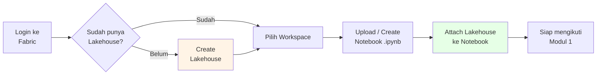
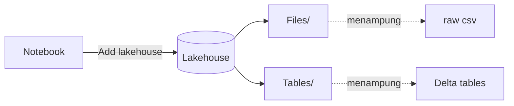

# Modul 0 — Prepare System

Sebelum memulai tutorial, siapkan **workspace**, **lakehouse**, dan **notebook** di Microsoft Fabric.

📖 Referensi resmi: <https://learn.microsoft.com/en-us/fabric/data-science/tutorial-data-science-prepare-system>

---

## 🎯 Tujuan

- Mengaktifkan workload Fabric Data Science
- Membuat Lakehouse
- Mengimpor / membuat Notebook untuk seluruh tutorial
- Meng-attach Lakehouse ke Notebook

---

## 🗺️ Alur Persiapan

---

## 1. Prasyarat

- Memiliki [Microsoft Fabric subscription](https://learn.microsoft.com/en-us/fabric/enterprise/licenses) atau [free trial](https://learn.microsoft.com/en-us/fabric/fundamentals/fabric-trial)
- Login ke <https://fabric.microsoft.com/>
- Pindah ke pengalaman **Fabric** lewat experience switcher (kiri-bawah)
- Jika belum ada Lakehouse, buat dengan mengikuti [Create a lakehouse in Microsoft Fabric](https://learn.microsoft.com/en-us/fabric/data-engineering/create-lakehouse)

---

## 2. Membuat / Mengimpor Notebook

Tutorial ini tersedia sebagai file Jupyter Notebook di GitHub. Pilih salah satu cara:

### Opsi A — Buat Notebook Baru
1. Buka workspace Anda
2. Klik **+ New** → **Notebook**
3. Salin-tempel kode dari setiap modul tutorial

### Opsi B — Upload Notebook dari GitHub
Download file dari folder [`data-science-tutorial`](https://github.com/microsoft/fabric-samples/tree/main/docs-samples/data-science/data-science-tutorial):

| Notebook | Modul Tutorial |
|----------|----------------|
| `1-ingest-data.ipynb` | Modul 1 |
| `2-explore-cleanse-data.ipynb` | Modul 2 |
| `3-train-evaluate.ipynb` | Modul 3 |
| `4-predict.ipynb` | Modul 4 |

> ⚠️ Pastikan men-download menggunakan link **"Raw"** di GitHub.

Lalu di Fabric:
1. Buka workspace
2. Klik **Upload** di command bar → pilih file `.ipynb`
3. Setelah ter-upload, buka notebook → menu **Edit** → **Clear all outputs**

### Opsi C — Sample dari Workload Data Science
1. Panel kiri → **Workloads** → **Data Science**
2. Pada kartu **Explore a sample**, klik **Select**
3. Pilih sample dari tab **End-to-end workflows (Python)**

---

## 3. Attach Lakehouse ke Notebook

> ⚠️ **Wajib** dilakukan untuk **setiap notebook** sebelum eksekusi sel.

1. Buka notebook di workspace
2. Pada panel kiri, klik **Add lakehouse**
3. Pilih:
   - **New** → buat Lakehouse baru, beri nama, lalu **Create**, atau
   - **Existing lakehouse** → pilih dari Data hub, lalu **Add**
4. Setelah ter-attach, Lakehouse muncul di panel kiri dan Anda dapat melihat folder **Files** & **Tables**.

---

## ✅ Checklist Sebelum Lanjut

- [ ] Workspace Fabric aktif
- [ ] 1 Lakehouse sudah dibuat
- [ ] Notebook untuk Modul 1–4 sudah tersedia di workspace
- [ ] Lakehouse ter-attach ke notebook Modul 1

➡️ Lanjut ke **[Modul 1 — Ingest Data](./01-ingest-data.md)**
