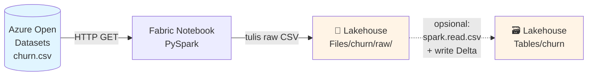

# Modul 1 — Ingest Data ke Fabric Lakehouse

Pada modul ini Anda akan menggunakan **Apache Spark** di Fabric Notebook untuk meng-ingest data CSV publik ke dalam **Delta Table** di Lakehouse.

📖 Referensi: <https://learn.microsoft.com/en-us/fabric/data-science/tutorial-data-science-ingest-data>

---

## 🎯 Tujuan

- Memahami konsep **Lakehouse** & **Delta Lake**
- Mendownload dataset *Bank Customer Churn* dari Azure Open Datasets
- Menyimpannya ke `Files/` di Lakehouse
- (Opsional) Menulis ke Delta Table

---

## 🧠 Konsep Inti

| Istilah | Penjelasan |
|---------|-----------|
| **Lakehouse** | Kombinasi data lake + database. Mendukung file (`Files/`) & tabel (`Tables/`) |
| **Delta Lake** | Format storage open-source dengan dukungan **ACID transactions** di atas Parquet |
| **Azure Open Datasets** | Kumpulan dataset publik yang dikelola Microsoft |

---

## 🗺️ Alur Modul 1



---

## 📦 Dataset: Bank Customer Churn

Dataset berisi 10.000 nasabah dengan atribut berikut:

| Kolom | Deskripsi |
|-------|-----------|
| `CustomerID`, `Surname`, `RowNumber` | Identifier (tidak dipakai untuk modeling) |
| `CreditScore` | Skor kredit |
| `Geography` | Negara (France / Germany / Spain) |
| `Gender` | Jenis kelamin |
| `Age` | Umur |
| `Tenure` | Lama menjadi nasabah (tahun) |
| `Balance` | Saldo |
| `NumOfProducts` | Jumlah produk yang dimiliki |
| `HasCrCard` | 1 jika punya kartu kredit |
| `IsActiveMember` | 1 jika nasabah aktif |
| `EstimatedSalary` | Estimasi gaji |
| **`Exited`** | **Target** — 1 = churn, 0 = bertahan |

### Contoh baris dataset

| CustomerID | Surname | CreditScore | Geography | Gender | Age | Tenure | Balance | NumOfProducts | HasCrCard | IsActiveMember | EstimatedSalary | Exited |
|---|---|---|---|---|---|---|---|---|---|---|---|---|
| 15634602 | Hargrave | 619 | France | Female | 42 | 2 | 0.00 | 1 | 1 | 1 | 101348.88 | 1 |
| 15647311 | Hill | 608 | Spain | Female | 41 | 1 | 83807.86 | 1 | 0 | 1 | 112542.58 | 0 |

> Kolom `RowNumber`, `CustomerID`, dan `Surname` **tidak relevan** untuk modeling — akan di-drop di Modul 2.

---

## 🛠️ Prasyarat

- Sudah menyelesaikan [Modul 0](./00-prepare-system.md)
- Notebook **`1-ingest-data`** sudah ter-attach ke Lakehouse
- Bahasa kernel: **PySpark (Python)**

> ⚠️ **Wajib** attach Lakehouse, jika tidak akan terjadi `FileNotFoundError`.

---

## 1️⃣ Definisikan Parameter

```python
IS_CUSTOM_DATA = False  # True jika ingin upload dataset sendiri secara manual

DATA_ROOT = "/lakehouse/default"
DATA_FOLDER = "Files/churn"     # folder tujuan
DATA_FILE = "churn.csv"         # nama file
```

---

## 2️⃣ Download & Simpan ke Lakehouse

```python
import os, requests

if not IS_CUSTOM_DATA:
    remote_url = "https://synapseaisolutionsa.z13.web.core.windows.net/data/bankcustomerchurn"
    file_list = [DATA_FILE]
    download_path = f"{DATA_ROOT}/{DATA_FOLDER}/raw"

    if not os.path.exists("/lakehouse/default"):
        raise FileNotFoundError(
            "Default lakehouse not found, please add a lakehouse and restart the session."
        )

    os.makedirs(download_path, exist_ok=True)
    for fname in file_list:
        if not os.path.exists(f"{download_path}/{fname}"):
            r = requests.get(f"{remote_url}/{fname}", timeout=30)
            with open(f"{download_path}/{fname}", "wb") as f:
                f.write(r.content)
    print("Downloaded demo data files into lakehouse.")
```

> 💡 Jika gagal akses URL publik, download `churn.csv` manual dari [fabric-samples GitHub](https://github.com/microsoft/fabric-samples/tree/main/docs-samples/data-science/data-science-tutorial) lalu upload ke `Files/churn/raw/` via UI Lakehouse.

---

## 3️⃣ Verifikasi File

Buka panel **Lakehouse** di sisi kiri Notebook → Refresh → buka folder `Files/churn/raw/` — pastikan `churn.csv` ada.

---

## ✅ Checklist Modul 1

- [ ] File `churn.csv` ada di `Files/churn/raw/`
- [ ] Tidak ada error pada eksekusi sel
- [ ] Lakehouse yang sama akan dipakai di Modul 2

➡️ Lanjut ke **[Modul 2 — Explore & Cleanse Data](./02-explore-cleanse-data.md)**
