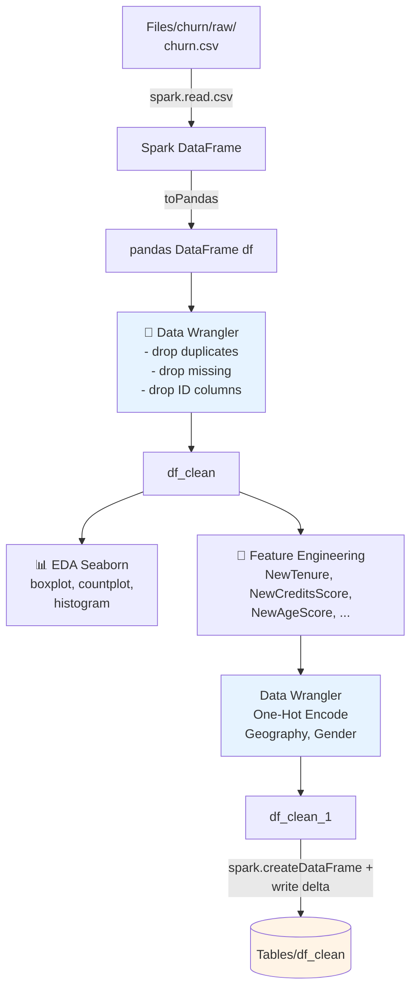

# Modul 2 — Explore & Cleanse Data

Pada modul ini Anda melakukan **Exploratory Data Analysis (EDA)** dan **data cleansing** menggunakan kombinasi **Apache Spark**, **pandas**, **Seaborn**, dan **Data Wrangler**.

📖 Referensi: <https://learn.microsoft.com/en-us/fabric/data-science/tutorial-data-science-explore-notebook>

---

## 🎯 Tujuan

1. Membaca raw CSV dari Lakehouse
2. Konversi Spark DataFrame → pandas DataFrame
3. **Data Wrangler** untuk drop duplicates, missing values, kolom tak relevan
4. EDA dengan Seaborn (boxplot, countplot, histogram)
5. Feature engineering & one-hot encoding
6. Simpan hasil ke Delta Table `df_clean`

---

## 🗺️ Alur Modul 2



---

## 1️⃣ Baca Raw Data

```python
df = (
    spark.read.option("header", True)
    .option("inferSchema", True)
    .csv("Files/churn/raw/churn.csv")
    .cache()
)
```

## 2️⃣ Konversi ke pandas DataFrame

```python
df = df.toPandas()
```

```python
import seaborn as sns
sns.set_theme(style="whitegrid", palette="tab10", rc={'figure.figsize': (9, 6)})
import matplotlib.pyplot as plt
import numpy as np
import pandas as pd
import itertools

display(df, summary=True)
```

### Versi awal `clean_data` (output Data Wrangler default)

Kode berikut adalah versi yang dihasilkan Data Wrangler **tanpa** `inplace=True` — menghasilkan DataFrame baru:

```python
# Code generated by Data Wrangler for pandas DataFrame

def clean_data(df):
    # Drop duplicate rows in columns: 'CustomerId', 'RowNumber'
    df = df.drop_duplicates(subset=['CustomerId', 'RowNumber'])
    # Drop rows with missing data across all columns
    df = df.dropna()
    # Drop columns: 'CustomerId', 'RowNumber', 'Surname'
    df = df.drop(columns=['CustomerId', 'RowNumber', 'Surname'])
    return df

df_clean = clean_data(df.copy())
df_clean.head()
```

---

## 3️⃣ Cleansing dengan Data Wrangler

> Data Wrangler tidak dapat dibuka jika sel notebook sedang berjalan.

1. Buka tab **Data** pada ribbon notebook → **Launch Data Wrangler**
2. Pilih DataFrame `df`


Data Wrangler akan menampilkan overview deskriptif data Anda. Tabel di tengah menampilkan setiap kolom data, sementara panel **Summary** di sampingnya menampilkan informasi DataFrame.


3. Lakukan operasi:
   - **Find and replace → Drop duplicate rows** (kolom: `RowNumber`, `CustomerId`)

     

     

   - **Find and replace → Drop missing values** (Select all)

     

   - **Schema → Drop columns** (`RowNumber`, `CustomerId`, `Surname`)

     

4. Klik **Add code to notebook**


Setiap kali Anda klik **Apply**, sebuah step baru ditambahkan ke panel **Cleaning steps** (kiri-bawah). Klik **Preview code for all steps** untuk melihat gabungan kode, lalu klik **Add code to notebook** (kiri-atas) untuk menutup Data Wrangler dan menyisipkan kode otomatis.

> 💡 **Tip:** Kode hasil Data Wrangler tidak otomatis dieksekusi — jalankan sel barunya secara manual.

Jika Anda **tidak** menggunakan Data Wrangler, gunakan langsung kode berikut. Versi ini menambahkan `inplace=True` agar pandas menimpa DataFrame asli (lebih hemat memori):

```python
# Modified version of code generated by Data Wrangler
# Modification is to add in-place=True to each step

def clean_data(df):
    # Drop rows with missing data across all columns
    df.dropna(inplace=True)
    # Drop duplicate rows in columns: 'RowNumber', 'CustomerId'
    df.drop_duplicates(subset=['RowNumber', 'CustomerId'], inplace=True)
    # Drop columns: 'RowNumber', 'CustomerId', 'Surname'
    df.drop(columns=['RowNumber', 'CustomerId', 'Surname'], inplace=True)
    return df

df_clean = clean_data(df.copy())
df_clean.head()
```

---

## 4️⃣ Eksplorasi Data (EDA)

### Tentukan tipe atribut

```python
dependent_variable_name = "Exited"

categorical_variables = [col for col in df_clean.columns
                         if col in "O" or df_clean[col].nunique() <= 5
                         and col not in "Exited"]

numeric_variables = [col for col in df_clean.columns
                     if df_clean[col].dtype != "object"
                     and df_clean[col].nunique() > 5]
```

### Five-number summary (boxplot)

```python
df_num_cols = df_clean[numeric_variables]
sns.set(font_scale=0.7)
fig, axes = plt.subplots(nrows=2, ncols=3, gridspec_kw=dict(hspace=0.3), figsize=(17, 8))
fig.tight_layout()
for ax, col in zip(axes.flatten(), df_num_cols.columns):
    sns.boxplot(x=df_num_cols[col], color='green', ax=ax)
fig.delaxes(axes[1, 2])
```


### Distribusi churn vs non-churn per kategori

```python
df_clean['Exited'] = df_clean['Exited'].astype(str)

attr_list = ['Geography', 'Gender', 'HasCrCard', 'IsActiveMember', 'NumOfProducts', 'Tenure']
fig, axarr = plt.subplots(2, 3, figsize=(15, 4))
for ind, item in enumerate(attr_list):
    sns.countplot(x=item, hue='Exited', data=df_clean, ax=axarr[ind % 2][ind // 2])
fig.subplots_adjust(hspace=0.7)

df_clean['Exited'] = df_clean['Exited'].astype(int)
```


### Histogram fitur numerik

```python
columns = df_num_cols.columns
fig = plt.figure()
fig.set_size_inches(18, 8)
length = len(columns)
for i, j in itertools.zip_longest(columns, range(length)):
    plt.subplot((length // 2), 3, j + 1)
    plt.subplots_adjust(wspace=0.2, hspace=0.5)
    df_num_cols[i].hist(bins=20, edgecolor='black')
    plt.title(i)
plt.show()
```


---

## 5️⃣ Feature Engineering

```python
df_clean['Tenure'] = df_clean['Tenure'].astype(int)
df_clean["NewTenure"]         = df_clean["Tenure"] / df_clean["Age"]
df_clean["NewCreditsScore"]   = pd.qcut(df_clean['CreditScore'], 6, labels=[1, 2, 3, 4, 5, 6])
df_clean["NewAgeScore"]       = pd.qcut(df_clean['Age'], 8, labels=[1, 2, 3, 4, 5, 6, 7, 8])
df_clean["NewBalanceScore"]   = pd.qcut(df_clean['Balance'].rank(method="first"), 5, labels=[1, 2, 3, 4, 5])
df_clean["NewEstSalaryScore"] = pd.qcut(df_clean['EstimatedSalary'], 10, labels=list(range(1, 11)))
```

---

## 6️⃣ One-Hot Encoding (via Data Wrangler atau langsung)

Buka kembali Data Wrangler, kali ini pilih DataFrame `df_clean`:

1. Expand **Formulas** → **One-hot encode**
2. Pilih kolom **Geography** dan **Gender**
3. **Add code to notebook**

Versi loop yang dihasilkan Data Wrangler:

```python
import pandas as pd

def clean_data(df_clean):
    # One-hot encode columns: 'Geography', 'Gender'
    for column in ['Geography', 'Gender']:
        insert_loc = df_clean.columns.get_loc(column)
        df_clean = pd.concat(
            [df_clean.iloc[:, :insert_loc],
             pd.get_dummies(df_clean.loc[:, [column]]),
             df_clean.iloc[:, insert_loc + 1:]],
            axis=1,
        )
    return df_clean

df_clean_1 = clean_data(df_clean.copy())
df_clean_1.head()
```

Versi ringkas (hasil yang sama):

```python
import pandas as pd

def clean_data(df_clean):
    df_clean = pd.get_dummies(df_clean, columns=['Geography', 'Gender'])
    return df_clean

df_clean_1 = clean_data(df_clean.copy())
df_clean_1.head()
```

---

## 7️⃣ Simpan ke Delta Table

```python
table_name = "df_clean"
sparkDF = spark.createDataFrame(df_clean_1)
sparkDF.write.mode("overwrite").format("delta").save(f"Tables/{table_name}")
print(f"Spark dataframe saved to delta table: {table_name}")
```

---

## 🔍 Ringkasan Observasi EDA (sesuai MS Learn)

- Mayoritas nasabah berasal dari **France** (dibanding Spain & Germany), sementara **Spain memiliki churn rate paling rendah** (Germany & France lebih tinggi).
- Sebagian besar nasabah memiliki **kartu kredit**.
- Ada nasabah dengan umur > 60 dan credit score < 400 — namun **bukan outlier**.
- Sangat sedikit nasabah yang memiliki **lebih dari 2 produk** bank.
- Nasabah **non-aktif** memiliki churn rate lebih tinggi.
- **Gender** dan **Tenure** tidak tampak berpengaruh pada keputusan menutup rekening.

---

## ✅ Checklist

- [ ] Tabel `df_clean` muncul di `Tables/` Lakehouse
- [ ] Sudah memahami distribusi target `Exited`

➡️ Lanjut ke **[Modul 3 — Train & Evaluate](./03-train-evaluate.md)**
