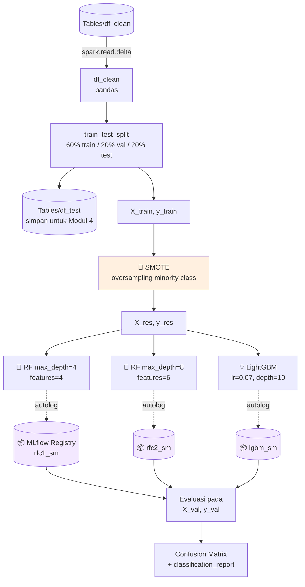

# Modul 3 — Train, Evaluate & Register Models

Pada modul ini Anda melatih beberapa model klasifikasi untuk memprediksi churn nasabah, melakukan tracking eksperimen dengan **MLflow**, lalu meregistrasi model ke **Fabric Model Registry**.

---

## 🎯 Tujuan

- Train **2 Random Forest** + **1 LightGBM** classifier
- Mengatasi class imbalance dengan **SMOTE**
- Logging hyperparameter & metric otomatis dengan **MLflow autologging**
- Registrasi model untuk dipakai di Modul 4

---

## 🗺️ Alur Modul 3



---

## 1️⃣ Install Library

> ⚠️ **Setiap kali notebook restart**, jalankan kembali sel `%pip install`. Jika tidak, Anda akan mendapatkan `ModuleNotFoundError` saat memanggil `imblearn`.

```python
%pip install imblearn
%pip install scikit-learn==1.6.1
%pip install "mlflow==2.12.2"
```

> 💡 Library yang diinstall via `%pip` hanya berlaku untuk **session notebook saat ini**, bukan workspace. Untuk pemakaian permanen, gunakan [**Fabric Environment**](https://aka.ms/fabric/create-environment) — admin workspace dapat menjadikannya environment default. Lihat juga [Migrate workspace libraries and Spark properties to a default environment](https://learn.microsoft.com/en-us/fabric/data-engineering/environment-workspace-migration).

---

## 2️⃣ Load Cleaned Data

```python
import pandas as pd
SEED = 12345
df_clean = spark.read.format("delta").load("Tables/df_clean").toPandas()
```

---

## 3️⃣ Setup MLflow Experiment

```python
import mlflow
EXPERIMENT_NAME = "bank-churn-experiment-SBM"
mlflow.set_experiment(EXPERIMENT_NAME)
mlflow.autolog(exclusive=False)
```

---

## 4️⃣ Train / Validation / Test Split

```python
from sklearn.model_selection import train_test_split
from lightgbm import LGBMClassifier
from sklearn.ensemble import RandomForestClassifier
from sklearn.metrics import (accuracy_score, f1_score, precision_score,
                             confusion_matrix, recall_score, roc_auc_score,
                             classification_report)

y = df_clean["Exited"]
X = df_clean.drop("Exited", axis=1)

# Train (60%), Val (20%), Test (20%)
X_train, X_test, y_train, y_test = train_test_split(X, y, test_size=0.20, random_state=SEED)
X_train, X_val,  y_train, y_val  = train_test_split(X_train, y_train, test_size=0.25, random_state=SEED)
```

### Simpan Test Set ke Delta

```python
table_name = "df_test"
df_test = spark.createDataFrame(X_test)
df_test.write.mode("overwrite").format("delta").save(f"Tables/{table_name}")
print(f"Spark test DataFrame saved to delta table: {table_name}")
```

---

## 5️⃣ SMOTE — Atasi Imbalance

> Hanya pada **training set**! Test set harus tetap distribusi aslinya.

```python
from collections import Counter
from imblearn.over_sampling import SMOTE

sm = SMOTE(random_state=SEED)
X_res, y_res = sm.fit_resample(X_train, y_train)
new_train = pd.concat([X_res, y_res], axis=1)
```

> ℹ️ Anda boleh **mengabaikan warning MLflow** yang muncul saat menjalankan sel ini. Jika Anda melihat **`ModuleNotFoundError`**, berarti sel `%pip install imblearn` belum dijalankan — kembali ke sel pertama dan jalankan ulang semua sel.

---

## 6️⃣ Train Model

### Random Forest #1 (depth=4, features=4)

```python
mlflow.sklearn.autolog(registered_model_name='rfc1_sm')
rfc1_sm = RandomForestClassifier(max_depth=4, max_features=4, min_samples_split=3, random_state=1)

with mlflow.start_run(run_name="rfc1_sm") as run:
    rfc1_sm_run_id = run.info.run_id
    rfc1_sm.fit(X_res, y_res.ravel())
    rfc1_sm.score(X_val, y_val)
    y_pred = rfc1_sm.predict(X_val)
    cr_rfc1_sm = classification_report(y_val, y_pred)
    cm_rfc1_sm = confusion_matrix(y_val, y_pred)
    roc_auc_rfc1_sm = roc_auc_score(y_res, rfc1_sm.predict_proba(X_res)[:, 1])
```

### Random Forest #2 (depth=8, features=6)

```python
mlflow.sklearn.autolog(registered_model_name='rfc2_sm')
rfc2_sm = RandomForestClassifier(max_depth=8, max_features=6, min_samples_split=3, random_state=1)

with mlflow.start_run(run_name="rfc2_sm") as run:
    rfc2_sm_run_id = run.info.run_id
    rfc2_sm.fit(X_res, y_res.ravel())
    y_pred = rfc2_sm.predict(X_val)
    cr_rfc2_sm = classification_report(y_val, y_pred)
    cm_rfc2_sm = confusion_matrix(y_val, y_pred)
    roc_auc_rfc2_sm = roc_auc_score(y_res, rfc2_sm.predict_proba(X_res)[:, 1])
```

### LightGBM

```python
mlflow.lightgbm.autolog(registered_model_name='lgbm_sm')

lgbm_sm_model = LGBMClassifier(
    learning_rate=0.07,
    max_delta_step=2,
    n_estimators=100,
    max_depth=10,
    eval_metric="logloss",
    objective='binary',
    random_state=42,
)

with mlflow.start_run(run_name="lgbm_sm") as run:
    lgbm1_sm_run_id = run.info.run_id
    lgbm_sm_model.fit(X_res, y_res.ravel())
    y_pred = lgbm_sm_model.predict(X_val)
    accuracy = accuracy_score(y_val, y_pred)
    cr_lgbm_sm = classification_report(y_val, y_pred)
    cm_lgbm_sm = confusion_matrix(y_val, y_pred)
    roc_auc_lgbm_sm = roc_auc_score(y_res, lgbm_sm_model.predict_proba(X_res)[:, 1])
```

---

## 7️⃣ Lihat Eksperimen di Workspace

1. Panel kiri → pilih workspace
2. Filter item **Experiments**


3. Klik `bank-churn-experiment-SBM` → pilih run untuk lihat metric & parameter


---

## 8️⃣ Evaluasi Model

Ada **dua pendekatan** untuk mengevaluasi model pada validation dataset — keduanya menghasilkan hasil identik. Tutorial ini menggunakan **Pendekatan #1** untuk mendemokan kemampuan MLflow autologging.

### Pendekatan #1 — Load model dari MLflow lalu predict

```python
# Define run_uri to fetch the model
load_model_rfc1_sm  = mlflow.sklearn.load_model(f"runs:/{rfc1_sm_run_id}/model")
load_model_rfc2_sm  = mlflow.sklearn.load_model(f"runs:/{rfc2_sm_run_id}/model")
load_model_lgbm1_sm = mlflow.lightgbm.load_model(f"runs:/{lgbm1_sm_run_id}/model")

# Assess the performance of the loaded model on validation dataset
ypred_rfc1_sm_v1  = load_model_rfc1_sm.predict(X_val)   # Random Forest depth=4, features=4
ypred_rfc2_sm_v1  = load_model_rfc2_sm.predict(X_val)   # Random Forest depth=8, features=6
ypred_lgbm1_sm_v1 = load_model_lgbm1_sm.predict(X_val)  # LightGBM
```

### Pendekatan #2 — Langsung gunakan objek model in-memory

```python
ypred_rfc1_sm_v2  = rfc1_sm.predict(X_val)         # Random Forest depth=4, features=4
ypred_rfc2_sm_v2  = rfc2_sm.predict(X_val)         # Random Forest depth=8, features=6
ypred_lgbm1_sm_v2 = lgbm_sm_model.predict(X_val)   # LightGBM
```

### Plot Confusion Matrix

```python
import seaborn as sns, matplotlib.pyplot as plt, numpy as np, itertools

def plot_confusion_matrix(cm, classes, normalize=False, title='Confusion matrix', cmap=plt.cm.Blues):
    plt.figure(figsize=(4, 4))
    plt.rcParams.update({'font.size': 10})
    plt.imshow(cm, interpolation='nearest', cmap=cmap)
    plt.title(title); plt.colorbar()
    tick_marks = np.arange(len(classes))
    plt.xticks(tick_marks, classes, rotation=45, color="blue")
    plt.yticks(tick_marks, classes, color="blue")
    fmt = '.2f' if normalize else 'd'
    thresh = cm.max() / 2.
    for i, j in itertools.product(range(cm.shape[0]), range(cm.shape[1])):
        plt.text(j, i, format(cm[i, j], fmt),
                 horizontalalignment="center",
                 color="red" if cm[i, j] > thresh else "black")
    plt.tight_layout(); plt.ylabel('True label'); plt.xlabel('Predicted label')

cfm = confusion_matrix(y_val, y_pred=ypred_lgbm1_sm_v1)
plot_confusion_matrix(cfm, classes=['Non Churn', 'Churn'], title='LightGBM')
```

> Ulangi `plot_confusion_matrix` untuk `ypred_rfc1_sm_v1` dan `ypred_rfc2_sm_v1`.

**Hasil confusion matrix dari MS Learn (referensi):**


*Random Forest — max depth 4, 4 features*


*Random Forest — max depth 8, 6 features*


*LightGBM — model dengan performa terbaik*

---

## 🏆 Pemilihan Model

Berdasarkan eksperimen, **`lgbm_sm` versi 1** memberikan performa terbaik dan akan dipakai untuk **batch scoring** di Modul 4.

---

## ✅ Checklist

- [ ] Eksperimen `bank-churn-experiment-SBM` muncul di workspace
- [ ] 3 registered model: `rfc1_sm`, `rfc2_sm`, `lgbm_sm`
- [ ] Tabel `df_test` ada di `Tables/`

➡️ Lanjut ke **[Modul 4 — Batch Scoring](./04-batch-scoring.md)**
