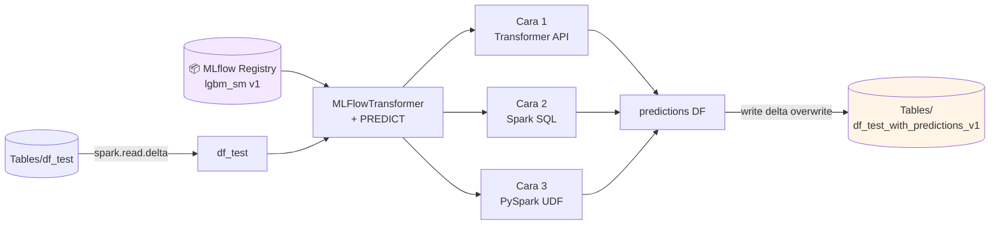

# Modul 4 — Batch Scoring dengan PREDICT

Pada modul ini Anda menggunakan model **`lgbm_sm` versi 1** (dari Modul 3) untuk melakukan **batch inference** pada `df_test` lalu menyimpan hasil prediksi ke Lakehouse — siap dipakai oleh Power BI di Modul 5.

---

## 🎯 Tujuan

- Memahami fungsi **PREDICT** di Microsoft Fabric
- Menjalankan batch scoring dengan 3 cara berbeda:
  1. **MLFlowTransformer** (SynapseML)
  2. **Spark SQL API**
  3. **PySpark UDF**
- Menyimpan prediksi ke `Tables/df_test_with_predictions_v1`

---

## 🗺️ Alur Modul 4



---

## 🛠️ Prasyarat

- Sudah menyelesaikan Modul 1–3
- Lakehouse yang sama dengan modul sebelumnya ter-attach ke notebook
- Notebook **`4-predict`**

```python
%pip install scikit-learn==1.6.1
```

---

## 1️⃣ Load Test Data

```python
df_test = spark.read.format("delta").load("Tables/df_test")
display(df_test)
```

---

## 2️⃣ Cara 1 — Transformer API (SynapseML)

```python
from synapse.ml.predict import MLFlowTransformer

model = MLFlowTransformer(
    inputCols=list(df_test.columns),
    outputCol='predictions',
    modelName='lgbm_sm',
    modelVersion=1,
)

import pandas
predictions = model.transform(df_test)
display(predictions)
```

> ⚠️ **Jika muncul error `ValueError: Cannot convert numpy type object to spark type`**, artinya `df_test` punya kolom bertipe `boolean` (hasil `pd.get_dummies` tanpa `dtype=int` di Modul 2). Dua opsi fix:
>
> 1. **Fix utama (disarankan)** — kembali ke [Modul 2](./02-explore-cleanse-data.md) langkah 6, ubah jadi `pd.get_dummies(..., dtype=int)`, lalu rerun Modul 2 → 3 → 4.
> 2. **Workaround cepat** — cast kolom boolean ke int sebelum `model.transform()`:
>     ```python
>     from pyspark.sql.functions import col
>     for f, t in df_test.dtypes:
>         if t == 'boolean':
>             df_test = df_test.withColumn(f, col(f).cast('int'))
>     ```

---

## 3️⃣ Cara 2 — Spark SQL API

```python
from pyspark.ml.feature import SQLTransformer

model_name = 'lgbm_sm'
model_version = 1
features = df_test.columns

sqlt = SQLTransformer().setStatement(
    f"SELECT PREDICT('{model_name}/{model_version}', {','.join(features)}) as predictions FROM __THIS__"
)

display(sqlt.transform(df_test))
```

---

## 4️⃣ Cara 3 — PySpark UDF

```python
from pyspark.sql.functions import col, pandas_udf, udf, lit

my_udf = model.to_udf()
features = df_test.columns

display(df_test.withColumn("predictions", my_udf(*[col(f) for f in features])))
```

---

## 5️⃣ Simpan Hasil ke Lakehouse

```python
table_name = "df_test_with_predictions_v1"
predictions.write.format('delta').mode("overwrite").save(f"Tables/{table_name}")
print(f"Spark DataFrame saved to delta table: {table_name}")
```

> Tabel ini akan menjadi sumber data untuk **semantic model** Power BI di Modul 5.

---

## 🆚 Perbandingan 3 Pendekatan PREDICT

| Pendekatan | Kelebihan | Kapan Dipakai |
|------------|-----------|---------------|
| **Transformer API** | Sederhana, idiomatic SynapseML | Pipeline ML berbasis Spark |
| **Spark SQL** | Bisa dipanggil dari analyst SQL | Tim data lebih familiar SQL |
| **PySpark UDF** | Fleksibel, kontrol per-row | Kebutuhan transformasi custom |

---

## ✅ Checklist

- [ ] Tabel `df_test_with_predictions_v1` ada di `Tables/`
- [ ] Kolom `predictions` muncul (nilai 0/1)

➡️ Lanjut ke **[Modul 5 — Power BI Report](./05-create-report.md)**
