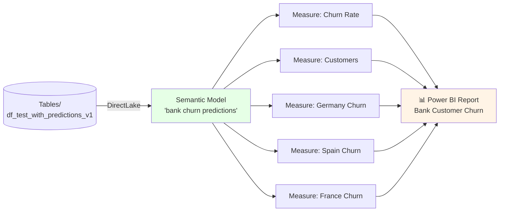
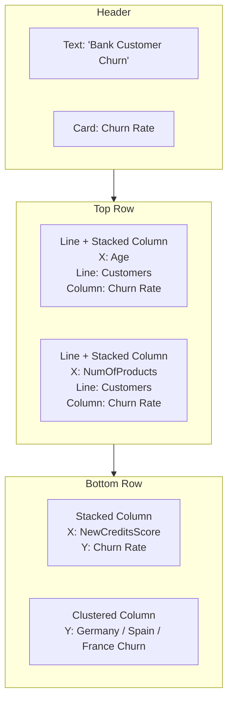
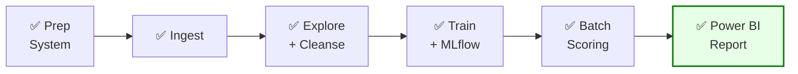

# Modul 5 — Visualisasi Prediksi dengan Power BI

Modul terakhir ini membangun **Power BI report** dari tabel prediksi yang Anda hasilkan di Modul 4 (`df_test_with_predictions_v1`) menggunakan **DirectLake**.

📖 Referensi: <https://learn.microsoft.com/en-us/fabric/data-science/tutorial-data-science-create-report>

---

## 🎯 Tujuan

- Membuat **Semantic Model** dari tabel prediksi
- Menambahkan **DAX measures** (Churn Rate, Customers, per-Geography churn)
- Membangun report dengan **Card**, **Line and stacked column chart**, **Stacked column chart**, dan **Clustered column chart**

---

## 🗺️ Alur Modul 5



---

## 1️⃣ Buat Semantic Model

1. Panel kiri → pilih **workspace**
2. Filter di kanan atas: **Lakehouse**

   

3. Buka Lakehouse yang sama dengan Modul 4

   

4. Pada ribbon Lakehouse, klik **New semantic model**

   

5. Beri nama: `bank churn predictions`
6. Centang tabel **`df_test_with_predictions_v1`** (alias `customer_churn_test_predictions`)

   

7. Klik **Confirm**

---

## 2️⃣ Tambahkan Measures (DAX)

> Klik **New measure** di ribbon, lalu ketik formula. Klik ✓ untuk apply.


### Churn Rate

```DAX
Churn Rate = AVERAGE(customer_churn_test_predictions[predictions])
```


Properties:
- Format: **Percentage**
- Decimal places: **1**


### Total Customers

> Setiap baris prediksi merepresentasikan satu nasabah — sehingga `COUNT(predictions)` = jumlah nasabah.

```DAX
Customers = COUNT(customer_churn_test_predictions[predictions])
```

### Churn per Negara

```DAX
Germany Churn = CALCULATE(
    AVERAGE(customer_churn_test_predictions[predictions]),
    FILTER(customer_churn_test_predictions, customer_churn_test_predictions[Geography_Germany] = TRUE())
)
```

```DAX
Spain Churn = CALCULATE(
    AVERAGE(customer_churn_test_predictions[predictions]),
    FILTER(customer_churn_test_predictions, customer_churn_test_predictions[Geography_Spain] = TRUE())
)
```

```DAX
France Churn = CALCULATE(
    AVERAGE(customer_churn_test_predictions[predictions]),
    FILTER(customer_churn_test_predictions, customer_churn_test_predictions[Geography_France] = TRUE())
)
```

---

## 3️⃣ Bangun Report

Klik **Create new report** di ribbon → buka tab Power BI authoring baru.


### Layout yang disarankan



### Langkah Detail

1. **Title** — tambahkan **Text box** dari ribbon, ketik: `Bank Customer Churn`. Atur **font size** dan **background color** lewat panel **Format** (atau format bar yang muncul saat teks dipilih).

   

   

2. **Card — Churn Rate** — di panel Visualizations pilih ikon **Card** → di **Data pane** centang **Churn Rate** → atur font/background lewat panel **Format** → drag ke pojok kanan atas.

   

   

   

   

3. **Line + Stacked Column (Age)** — X-axis: `Age`, **Line y-axis**: `Customers`, **Column y-axis**: `Churn Rate`.

   

   

   

4. **Line + Stacked Column (NumOfProducts)** — X-axis: `NumOfProducts`, **Line y-axis**: `Customers`, **Column y-axis**: `Churn Rate`.
   > ⚠️ Pastikan field **Column y-axis** hanya berisi **satu instance** `Churn Rate`. Hapus field lain bila ada.

   

5. **Stacked Column (Credit Score)** — X-axis: `NewCreditsScore`, Y-axis: `Churn Rate`. Di panel **Format** ubah judul `NewCreditsScore` menjadi `Credit Score`.
   > 💡 Anda mungkin perlu memperlebar X-axis chart ini agar label terbaca.

   

   

6. **Clustered Column (per Country)** — Y-axis (urut): `Germany Churn`, `Spain Churn`, `France Churn`. Atur ukuran chart sesuai kebutuhan.

   

> 📝 **Catatan:** Tutorial ini mendemokan analisis dasar di Power BI. Untuk skenario churn nyata, Anda dapat memperluas dengan visualisasi tambahan sesuai kebutuhan tim bisnis dan KPI yang sudah distandardisasi.

---

## 🔍 Insight Akhir

- 🔴 Nasabah dengan **>2 produk** memiliki churn rate jauh lebih tinggi → bank perlu investigasi alasannya.
- 🌍 Nasabah di **Germany** punya churn rate tertinggi vs France & Spain.
- 👥 Rentang usia **45–60** paling rawan churn.
- 📉 Nasabah dengan **credit score rendah** lebih mungkin pindah → tawarkan program retention.

---

## 🎓 Selamat!

Anda telah menyelesaikan tutorial **end-to-end Microsoft Fabric Data Science**:



### 📚 Bacaan Lanjutan

- [Microsoft Fabric Data Science overview](https://learn.microsoft.com/en-us/fabric/data-science/data-science-overview)
- [Machine learning model scoring with PREDICT](https://learn.microsoft.com/en-us/fabric/data-science/model-scoring-predict)
- [MLflow autologging in Fabric](https://aka.ms/fabric-autologging)
- [Data Wrangler](https://learn.microsoft.com/en-us/fabric/data-science/data-wrangler)
- [SemPy library](https://learn.microsoft.com/en-us/fabric/data-science/semantic-link-overview)

⬅️ Kembali ke **[README](./README.md)**
