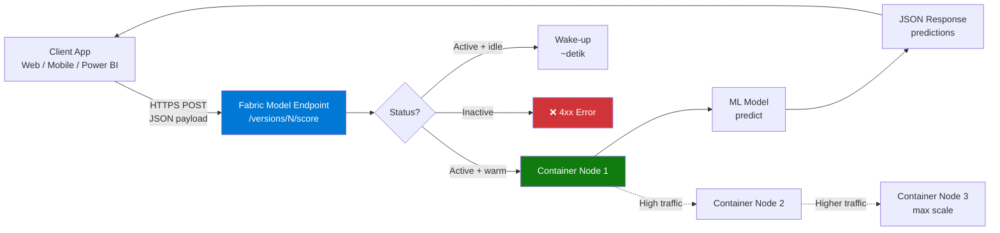
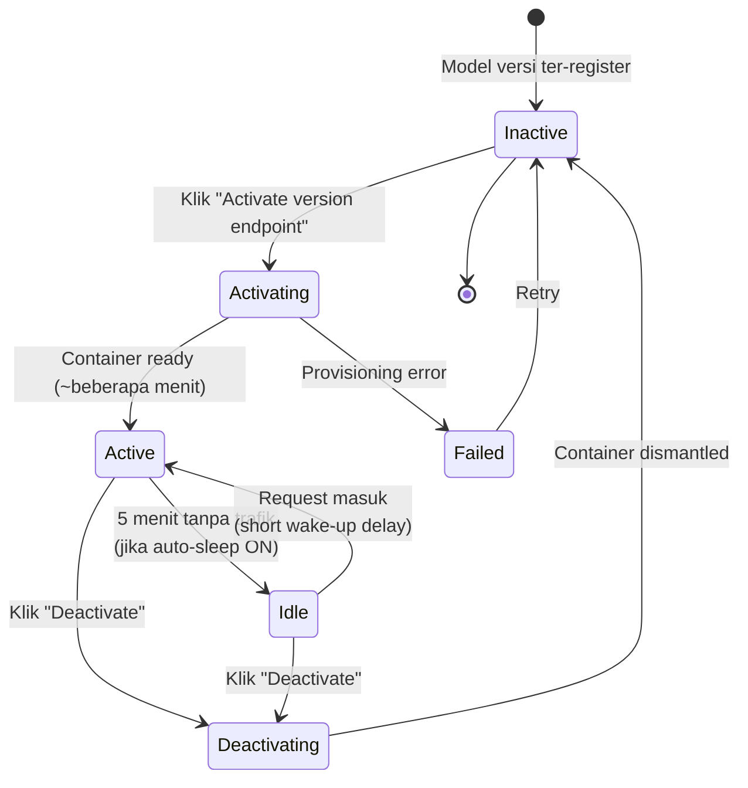
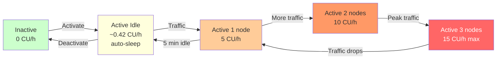
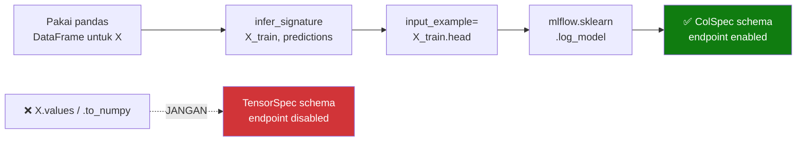

# Modul 6: Serve Real-Time Predictions dengan ML Model Endpoints

> 📚 **Referensi resmi**: [Serve real-time predictions with ML model endpoints (Preview)](https://learn.microsoft.com/en-us/fabric/data-science/model-endpoints)
>
> ⚠️ **Status fitur**: Preview (per April 2026)

Setelah di [Modul 3](03-train-evaluate.md) kamu **train & register model** dan di [Modul 4](04-batch-scoring.md) menjalankan **batch scoring** (PREDICT), modul ini melengkapi dengan cara ke-3 yaitu **real-time inference** lewat HTTPS endpoint.

> 🧪 **Catatan tutorial**: Modul ini sengaja **tidak memakai model churn** dari Modul 3, karena model tersebut sering ter-log dengan **tensor schema** sehingga endpoint-nya **tidak bisa diaktifkan** (tombol grey-out + pesan *"Endpoints aren't supported for this model"*).
>
> Sebagai gantinya kita pakai **dataset publik built-in `scikit-learn`** (Iris) yang **dijamin endpoint-compatible** — bisa di-train & di-register dalam < 1 menit tanpa download data apapun. Sample alternatif (Wine, Breast Cancer) ada di [Appendix](#-appendix-sample-model-alternatif).

---

## 📋 Daftar Isi

1. [Apa itu ML Model Endpoints?](#1-apa-itu-ml-model-endpoints)
2. [Kapan dipakai? (Real-time vs Batch)](#2-kapan-dipakai-real-time-vs-batch)
3. [Model yang didukung](#3-model-yang-didukung)
4. [Arsitektur Endpoint](#4-arsitektur-endpoint)
5. [Lifecycle Endpoint](#5-lifecycle-endpoint)
6. [Step-by-Step: Train & Register Sample Model (Iris)](#6-step-by-step-train--register-sample-model-iris)
7. [Step-by-Step: Aktivasi Endpoint](#7-step-by-step-aktivasi-endpoint)
8. [Step-by-Step: Test dengan Preview Predictions](#8-step-by-step-test-dengan-preview-predictions)
9. [Manage Endpoints (default version, auto sleep)](#9-manage-endpoints-default-version-auto-sleep)
10. [Query lewat REST API](#10-query-lewat-rest-api)
11. [Konsumsi Capacity (CU)](#11-konsumsi-capacity-cu)
12. [Best Practices & Troubleshooting](#12-best-practices--troubleshooting)
13. [Cleanup](#13-cleanup)
14. [Appendix: Sample Model Alternatif](#-appendix-sample-model-alternatif)

---

## 1. Apa itu ML Model Endpoints?

**ML Model Endpoints** adalah fitur Fabric Data Science yang otomatis menyediakan **HTTPS REST endpoint** untuk model yang sudah kamu register di Fabric — tanpa setup container/Kubernetes/web server sendiri.

> Microsoft Fabric lets you serve real-time predictions from ML models with secure, scalable, and easy-to-use online endpoints. These endpoints are available as built-in properties of most Fabric models — and they require no setup to kick off fully managed real-time deployments.
> — [MS Learn](https://learn.microsoft.com/en-us/fabric/data-science/model-endpoints)

### 🎯 Kunci pemahaman

| Aspek | Penjelasan |
|---|---|
| **Built-in** | Setiap model versi yang di-register **otomatis punya endpoint URL** (default Inactive) |
| **Managed** | Fabric handle container, scaling, networking — kamu hanya tekan tombol **Activate** |
| **Per-version** | Tiap versi model punya endpoint sendiri (`/versions/1/score`, `/versions/2/score`, dll) |
| **Auto-scale** | Bisa scale otomatis sampai **3 nodes** berdasar trafik |
| **Auto-sleep** | Idle 5 menit → scale ke 0 (hemat CU) |

📷 *Lihat overview di MS Learn:* [overview.jpg](https://learn.microsoft.com/en-us/fabric/data-science/media/model-endpoints/overview.jpg)

---

## 2. Kapan dipakai? (Real-time vs Batch)

Fabric punya 3 cara serving prediksi. Pilih yang sesuai use case:

| Cara | Latency | Use case | Modul |
|---|---|---|---|
| **PREDICT (batch)** | Menit/jam | Score jutaan baris → tulis ke Delta table | [Modul 4](04-batch-scoring.md) |
| **Notebook ad-hoc** | Detik | Eksplorasi, tes manual | Notebook biasa |
| **Model Endpoint** ⭐ | **Milidetik** | App web/mobile butuh prediksi instan | **Modul ini** |

### Contoh skenario real-time

- 🏦 **Churn prediction** real-time saat customer login → tampilkan offer retensi
- 🛒 **Fraud detection** saat transaksi POS dilakukan
- 🎯 **Recommendation** produk saat user buka halaman
- 📞 **Call center scoring** — saat agent angkat telepon

---

## 3. Model yang didukung

Per dokumentasi resmi (April 2026):

### ✅ Model flavors yang didukung

| Flavor | Library |
|---|---|
| **Sklearn** | `scikit-learn` (RandomForest, LogisticRegression, dll) |
| **LightGBM** | `lightgbm` |
| **XGBoost** | `xgboost` |
| **Keras** | `keras` / `tensorflow.keras` |
| **AutoML** | ✨ **Baru!** Didukung sejak Jan 2026 |

### ❌ Limitations

- Model dengan **tensor-based schemas** atau **no schema** belum didukung
- Maksimum **5 active endpoint** per model (kalau perlu versi ke-6, deactivate dulu salah satunya)

> 💡 Model di [Modul 3](03-train-evaluate.md) tutorial ini pakai `LightGBMClassifier` dan `RandomForestClassifier` (sklearn) → **kompatibel** dengan endpoint!

---

## 4. Arsitektur Endpoint



**Highlights**:
- 🔒 **Secure** — endpoint butuh authentication token (Entra ID)
- 📈 **Auto-scale** — 1 → 3 nodes berdasarkan load
- 💤 **Auto-sleep** — idle 5 menit → scale ke 0 nodes (saving)

---

## 5. Lifecycle Endpoint



| Status | Konsumsi CU? | Bisa serve prediksi? |
|---|---|---|
| **Inactive** | ❌ 0 CU | ❌ Tidak |
| **Activating** | ⏳ Sedang setup | ❌ Belum |
| **Active** (with traffic) | ✅ Per node aktif | ✅ Ya |
| **Active** (idle, auto-sleep ON) | ❌ ~0 CU | ⏳ Wake-up delay di request pertama |
| **Deactivating** | ⏳ Sedang dismantle | ❌ Tidak |
| **Failed** | ❌ 0 CU | ❌ Tidak |

---

## 6. Step-by-Step: Train & Register Sample Model (Iris)

### Prasyarat
- ✅ Workspace Fabric sudah aktif (Trial atau Capacity)
- ✅ Tenant admin **tidak menonaktifkan** ML Model Endpoints (default ON)

### Kenapa Iris?

| Alasan | Detail |
|---|---|
| 📦 **No download** | Dataset built-in di `sklearn` (sudah pre-installed di runtime Fabric) |
| ⚡ **Cepat train** | < 1 detik training, total notebook < 1 menit |
| ✅ **Endpoint-compatible** | Schema column-based (bukan tensor) → tombol Activate **enabled** |
| 🧠 **Realistis** | Multi-class classification (3 kelas), 4 fitur numerik |

### Langkah-langkah

> 💡 **Shortcut**: Sudah ada notebook siap-import [`notebooks/6-model-endpoints.ipynb`](notebooks/6-model-endpoints.ipynb) yang berisi semua cell di bawah + verifikasi schema otomatis + REST API test. Lihat [opsi 1](#opsi-1--import-notebook-siap-pakai-recommended) di bawah untuk import langsung.

#### Opsi 1 — Import notebook siap-pakai (recommended)

1. Buka Fabric workspace → klik **+ New** → **Import** → **Notebook** → **From this computer**
2. Pilih file `notebooks/6-model-endpoints.ipynb` dari folder tutorial ini
3. Setelah ter-import, klik notebook → **Run all** (atau jalankan cell satu per satu)
4. Setelah cell ke-4 selesai dengan pesan `✅ Column-based schema — endpoint READY`, lanjut ke [Section 7 — Aktivasi Endpoint](#7-step-by-step-aktivasi-endpoint)

📷 *Lihat panduan import notebook resmi:* [Import existing notebooks (MS Learn)](https://learn.microsoft.com/en-us/fabric/data-engineering/how-to-use-notebook#import-existing-notebooks)

#### Opsi 2 — Buat notebook baru & paste manual

#### 1️⃣ Buat notebook baru di workspace

Di Fabric workspace → **+ New** → **Notebook** → beri nama `06-iris-endpoint-demo.ipynb`.

#### 2️⃣ Paste & run cell ini

```python
import mlflow
import mlflow.sklearn
from sklearn.datasets import load_iris
from sklearn.ensemble import RandomForestClassifier
from sklearn.model_selection import train_test_split
from mlflow.models.signature import infer_signature

# 1. Load dataset publik dari sklearn (no download needed)
iris = load_iris(as_frame=True)
X = iris.data       # ⚠️ pandas DataFrame — KUNCI agar endpoint enabled!
y = iris.target

X_train, X_test, y_train, y_test = train_test_split(
    X, y, test_size=0.2, random_state=42
)

# 2. Set/buat experiment
mlflow.set_experiment("iris-endpoint-demo")

# 3. Train + log dengan signature COLUMN-BASED (bukan tensor)
with mlflow.start_run() as run:
    model = RandomForestClassifier(n_estimators=50, random_state=42)
    model.fit(X_train, y_train)

    accuracy = model.score(X_test, y_test)
    mlflow.log_metric("accuracy", accuracy)

    # ✅ KUNCI: pakai DataFrame untuk input & pd.Series untuk output
    # (output ndarray → schema jadi Tensor → endpoint disabled!)
    preds_train = pd.Series(model.predict(X_train), name="prediction")
    signature = infer_signature(X_train, preds_train)

    mlflow.sklearn.log_model(
        sk_model=model,
        artifact_path="model",
        signature=signature,
        input_example=X_train.head(3),       # ⬅️ DataFrame!
        registered_model_name="iris_sample_model",
    )
    print(f"✅ Registered. Run ID: {run.info.run_id}, Accuracy: {accuracy:.4f}")
```

#### 3️⃣ Verifikasi schema column-based

Jalankan cell tambahan untuk konfirmasi:

```python
client = mlflow.tracking.MlflowClient()
mv = client.get_model_version(name="iris_sample_model", version="1")
loaded = mlflow.pyfunc.load_model(mv.source)
print("Input :", loaded.metadata.get_input_schema())
print("Output:", loaded.metadata.get_output_schema())
```

Output yang **benar** — kedua schema mengandung `ColSpec` (column-based):

```
Input : ['sepal length (cm)': double (required), ...]
Output: ['prediction': long (required)]
```

Kalau salah satu muncul `Tensor(...)` → balik ke step 2:
- Tensor di **input** → `X` bukan DataFrame
- Tensor di **output** → `model.predict(...)` belum dibungkus `pd.Series`

> ⚠️ **Aturan emas agar endpoint enabled**:
> 1. ✅ `X` harus `pd.DataFrame` — **bukan** `np.ndarray`
> 2. ✅ Output predict bungkus `pd.Series(model.predict(X_train), name="prediction")` — **bukan** ndarray mentah
> 3. ✅ `input_example=X_train.head(N)` — **bukan** `X_train.values[:N]`
> 4. ✅ Hindari pipeline yang outputnya ndarray (mis. `StandardScaler` tanpa `set_output(transform="pandas")`)

---

## 7. Step-by-Step: Aktivasi Endpoint

### Langkah-langkah

#### 1️⃣ Buka model di Fabric workspace
1. Buka **workspace** kamu di [app.fabric.microsoft.com](https://app.fabric.microsoft.com)
2. Klik ML model **`iris_sample_model`** yang baru ter-register
3. Pilih **Version 1**

#### 2️⃣ Klik "Activate version endpoint"
Di ribbon atas, klik tombol **Activate version endpoint** (sekarang **enabled**, tidak grey-out lagi).

📷 *Referensi screenshot:* [activate.jpg](https://learn.microsoft.com/en-us/fabric/data-science/media/model-endpoints/activate.jpg)

#### 3️⃣ Tunggu status berubah menjadi `Active`
Toast message muncul: *"Getting your endpoint ready..."*. Status berubah:

```
Inactive → Activating (beberapa menit) → Active ✅
```

📷 *Referensi screenshot:* [activating.jpg](https://learn.microsoft.com/en-us/fabric/data-science/media/model-endpoints/activating.jpg)

#### 4️⃣ Catat Endpoint URL

Di tab **Endpoint details**, copy URL endpoint. Format resmi (per [Score ML Model Endpoint Version REST API](https://learn.microsoft.com/en-us/rest/api/fabric/mlmodel/endpoint/score-ml-model-endpoint-version)):

**Per-version endpoint** (URL spesifik untuk versi tertentu):
```
https://api.fabric.microsoft.com/v1/workspaces/{workspaceId}/mlmodels/{modelId}/endpoint/versions/{versionName}/score
```

**Default endpoint** (URL yang otomatis ke default version):
```
https://api.fabric.microsoft.com/v1/workspaces/{workspaceId}/mlModels/{modelId}/endpoint/score
```

> ⚠️ **Catatan format URL**:
> - Host: `api.fabric.microsoft.com` (**tanpa** prefix region)
> - Ada segment `/endpoint/` setelah `{modelId}`
> - `versionName` umumnya `1`, `2`, dst (string)

📷 *Referensi screenshot:* [inactive.jpg](https://learn.microsoft.com/en-us/fabric/data-science/media/model-endpoints/inactive.jpg)

---

## 8. Step-by-Step: Test dengan Preview Predictions

Fabric punya **low-code tester** built-in — tidak perlu Postman/curl untuk testing awal.

### 1️⃣ Buka "Preview predictions"
Di halaman model versi yang sudah Active → klik **Preview predictions** di ribbon.

### 2️⃣ Isi form atau pakai Autofill
Form fields otomatis di-generate dari **input signature** model — untuk Iris akan muncul 4 field: `sepal length (cm)`, `sepal width (cm)`, `petal length (cm)`, `petal width (cm)`.

- Klik **Autofill** untuk dapat random sample
- Atau isi manual nilai-nilai test

📷 *Referensi screenshot:* [form-preview.jpg](https://learn.microsoft.com/en-us/fabric/data-science/media/model-endpoints/form-preview.jpg)

### 3️⃣ Klik "Get predictions"
Hasil prediksi muncul di panel kanan.

### 4️⃣ (Opsional) Switch ke JSON view
Lewat dropdown view selector — berguna untuk copy payload yang akan dipakai di REST API.

📷 *Referensi screenshot:* [json-preview.jpg](https://learn.microsoft.com/en-us/fabric/data-science/media/model-endpoints/json-preview.jpg)

**Contoh JSON payload** (untuk model Iris) — sesuai spec REST API resmi:

```json
{
  "formatType": "dataframe",
  "orientation": "split",
  "inputs": {
    "columns": [
      "sepal length (cm)",
      "sepal width (cm)",
      "petal length (cm)",
      "petal width (cm)"
    ],
    "data": [
      [5.1, 3.5, 1.4, 0.2],
      [6.7, 3.0, 5.2, 2.3]
    ]
  }
}
```

Atau format paling minimal (`orientation: "values"` — array of arrays, kolom mengikuti urutan signature):

```json
{
  "formatType": "dataframe",
  "orientation": "values",
  "inputs": [
    [5.1, 3.5, 1.4, 0.2],
    [6.7, 3.0, 5.2, 2.3]
  ]
}
```

**Contoh response** (per [ScoreDataResponse spec](https://learn.microsoft.com/en-us/rest/api/fabric/mlmodel/endpoint/score-ml-model-endpoint-version#scoredataresponse)):

```json
{
  "formatType": "dataframe",
  "orientation": "values",
  "predictions": [
    [0],
    [2]
  ]
}
```

> `0` = setosa, `1` = versicolor, `2` = virginica
>
> ℹ️ **Orientation values** yang didukung: `split`, `values`, `record`, `index`, `table` — mirroring [pandas `to_dict()` orientations](https://pandas.pydata.org/docs/reference/api/pandas.DataFrame.to_dict.html).

---

## 9. Manage Endpoints (default version, auto sleep)

### Set Default Version

Default endpoint = URL tanpa `/versions/N/`. Berguna supaya client app **tidak perlu di-update** tiap kali ada model baru — kamu cukup ubah default version-nya.

1. Klik **Manage endpoints** di ribbon
2. Pilih versi yang akan jadi default lewat dropdown
3. ⚠️ **Default version harus dalam status Active** — kalau Inactive, request ke default URL akan gagal

📷 *Referensi screenshot:* [set-default.jpg](https://learn.microsoft.com/en-us/fabric/data-science/media/model-endpoints/set-default.jpg)

### Auto Sleep On/Off

| Setting | Behavior | Cocok untuk |
|---|---|---|
| **Auto Sleep ON** (default) | Idle 5 menit → scale to 0 → hemat CU. Wake-up delay di request pertama | Dev/test, low-traffic |
| **Auto Sleep OFF** | Selalu warm, tidak ada cold start | **Production** dengan SLA latency ketat |

📷 *Referensi screenshot:* [auto-sleep.jpg](https://learn.microsoft.com/en-us/fabric/data-science/media/model-endpoints/auto-sleep.jpg)

---

## 10. Query lewat REST API

Untuk integrasi dari aplikasi kamu, pakai REST API. Dokumentasi lengkap: [Endpoint REST API](https://learn.microsoft.com/en-us/rest/api/fabric/mlmodel/endpoint).

### Permission yang dibutuhkan

Per [REST API spec](https://learn.microsoft.com/en-us/rest/api/fabric/mlmodel/endpoint/score-ml-model-endpoint-version):

| Item | Detail |
|---|---|
| **Permission on MLModel** | **Write** (caller harus punya write permission pada MLModel item) |
| **Required Delegated Scopes** | `MLModel.ReadWrite.All` **atau** `Item.ReadWrite.All` |
| **Identity yang didukung** | User, Service principal, Managed identity ✅ |

### Contoh dengan Python (`requests`) — pakai Iris model

```python
import requests
from azure.identity import DefaultAzureCredential

# 1. Get bearer token (Entra ID)
#    Scope `.default` akan request semua delegated/app permission yang sudah granted.
credential = DefaultAzureCredential()
token = credential.get_token("https://api.fabric.microsoft.com/.default").token

# 2. Endpoint URL — format resmi (tanpa region prefix, ada segment /endpoint/)
workspace_id = "<workspace-id>"   # GUID, copy dari Fabric URL
model_id     = "<model-id>"       # GUID, copy dari Endpoint details
version      = "1"

endpoint_url = (
    f"https://api.fabric.microsoft.com/v1/workspaces/{workspace_id}"
    f"/mlmodels/{model_id}/endpoint/versions/{version}/score"
)

# 3. Payload — format "split" supaya kolom eksplisit
payload = {
    "formatType": "dataframe",
    "orientation": "split",
    "inputs": {
        "columns": [
            "sepal length (cm)",
            "sepal width (cm)",
            "petal length (cm)",
            "petal width (cm)",
        ],
        "data": [
            [5.1, 3.5, 1.4, 0.2],
            [6.7, 3.0, 5.2, 2.3],
        ],
    },
}

# 4. Call endpoint
response = requests.post(
    endpoint_url,
    headers={
        "Authorization": f"Bearer {token}",
        "Content-Type": "application/json",
    },
    json=payload,
    timeout=30,
)

print(response.status_code)

# 5. Handle response
if response.status_code == 200:
    print(response.json())
    # {"formatType":"dataframe","orientation":"values","predictions":[[0],[2]]}
elif response.status_code == 202:
    # Long Running Operation — polling diperlukan
    op_url = response.headers["Location"]
    retry_after = int(response.headers.get("Retry-After", 5))
    print(f"LRO accepted. Poll {op_url} after {retry_after}s")
elif response.status_code == 429:
    # Rate-limited — honor Retry-After
    print(f"Throttled. Retry after {response.headers.get('Retry-After')}s")
else:
    print(response.text)
```

> 💡 **Long Running Operation (LRO)**: Score API support [LRO pattern](https://learn.microsoft.com/en-us/rest/api/fabric/articles/long-running-operation). Jika request lambat (mis. cold-start endpoint), kamu bisa dapat **`202 Accepted`** dengan header `Location` dan `x-ms-operation-id` — polling URL tersebut sampai status `Succeeded`.

### Integrasi lain

| Tool | Caranya |
|---|---|
| **Dataflow Gen2** | Native step "ML model endpoints" — [docs](https://learn.microsoft.com/en-us/fabric/data-factory/dataflow-gen2-machine-learning-model-endpoints) |
| **Power BI** | Lewat Dataflow Gen2 → tabel hasil prediksi |
| **Azure Function / Logic App** | HTTP action → endpoint URL |
| **Web app (Node/Java/.NET)** | HTTP client + Entra token |

---

## 11. Konsumsi Capacity (CU)

Endpoint = **background operation** yang konsumsi Fabric **Capacity Units (CU)**.

### Tarif resmi

| Operasi | Rate |
|---|---|
| **1 model endpoint per node per detik** | **5 CU seconds** |

### Skenario kasar (per dokumentasi)

| Skenario | CU/detik | CU/jam |
|---|---|---|
| Endpoint **Inactive** | 0 | 0 |
| **Active tapi Idle** (auto-sleep, no traffic) | 5 | 0.42 |
| **Active**, low traffic, 1 node | 5 | 5 |
| **Active**, high traffic, scale ke 3 nodes | 15 | 15 |
| **5 endpoints** active, semua high traffic, scale max | 75 | 75 |

> 💰 Cek konsumsi aktual di [Fabric Capacity Metrics App](https://learn.microsoft.com/en-us/fabric/enterprise/metrics-app-compute-page) → cari item **"Model Endpoint"** atau invoice line **"ML Model Endpoint Capacity Usage CU"**.

### Visualisasi konsumsi



---

## 12. Best Practices & Troubleshooting

### ✅ Best Practices

| Praktek | Alasan |
|---|---|
| **Auto-sleep ON untuk dev/test, OFF untuk production** | Hemat CU di dev, hindari cold-start di prod |
| **Pakai Default Version** di client app | Update model tanpa redeploy app |
| **Deactivate endpoint yang tidak terpakai** | Walaupun idle, masih ada base CU consumption |
| **Test pakai Preview Predictions dulu** | Validasi schema input/output sebelum integrasi |
| **Monitor lewat Capacity Metrics App** | Spot anomali konsumsi sejak dini |
| **Gunakan staging version** sebelum jadi default | Hindari breaking production |

### 🔧 Troubleshooting umum

| Masalah | Kemungkinan penyebab | Solusi |
|---|---|---|
| Status `Failed` saat activate | Model schema tidak valid (tensor/no schema) | Re-register model dengan schema column-based |
| Tombol **Activate** grey-out + *"Endpoints aren't supported for this model"* | Schema kosong atau tensor | Lihat [aturan emas](#3️⃣-verifikasi-schema-column-based) di Section 6 |
| Request ke default URL → 4xx | Default version belum di-set / set ke versi Inactive | Set default ke versi Active di **Manage endpoints** |
| `400 BadInput` | Payload schema tidak match signature, `formatType`/`orientation` salah | Cek nama kolom & order, default `formatType: "dataframe"` |
| `403 Forbidden` | User/SP tidak punya **Write** permission pada MLModel | Grant `MLModel.ReadWrite.All` atau `Item.ReadWrite.All` |
| `404 NotFound` | `workspaceId`/`modelId`/`versionName` salah, atau version dideactivate | Cek URL di Endpoint details |
| `429 Too Many Requests` | Rate limit terlampaui | Honor header `Retry-After`, implement back-off |
| `202 Accepted` (bukan 200) | Long Running Operation (cold start) | Poll URL di header `Location` sampai status `Succeeded` |
| Cold-start lambat | Auto-sleep ON | Untuk prod, **OFF**-kan auto-sleep |
| Tidak bisa activate versi ke-6 | Limit 5 active per model | Deactivate salah satu versi dulu |
| `401 Unauthorized` | Token Entra expired/wrong scope | Refresh token, scope: `https://api.fabric.microsoft.com/.default` |
| Endpoint tidak muncul di model | Tenant admin disable feature | Cek Admin Portal → Tenant settings → ML model endpoints |

---

## 13. Cleanup

Setelah selesai eksperimen, **deactivate** endpoint untuk hentikan konsumsi CU.

### Lewat UI
1. Buka model versi → ribbon → **Deactivate version endpoint**
2. Atau **Manage endpoints** → pilih beberapa sekaligus → **Deactivate**

📷 *Referensi screenshot:*
- [deactivate.jpg](https://learn.microsoft.com/en-us/fabric/data-science/media/model-endpoints/deactivate.jpg)
- [deactivate-multiple.jpg](https://learn.microsoft.com/en-us/fabric/data-science/media/model-endpoints/deactivate-multiple.jpg)

Status berubah: `Active → Deactivating → Inactive` (beberapa detik).

---

## 🎓 Ringkasan

| Yang kamu pelajari | Kesimpulan |
|---|---|
| ML Model Endpoints = **REST endpoint built-in** untuk model Fabric | No-code aktivasi, fully managed |
| Mendukung **Sklearn, LightGBM, XGBoost, Keras, AutoML** | Termasuk model di tutorial ini |
| Lifecycle: **Inactive → Activating → Active → (Idle) → Deactivating** | Max 5 active per model |
| **5 CU/detik per node**, max 3 nodes auto-scale | Auto-sleep hemat biaya untuk dev |
| Bisa diakses lewat **UI Preview, REST API, Dataflow Gen2** | Fleksibel untuk berbagai integrasi |

---

## 🧪 Appendix: Sample Model Alternatif

> Kalau ingin variasi selain Iris (Section 6), berikut 2 dataset publik built-in `sklearn` lain yang juga **dijamin endpoint-compatible**.

### 🍷 Alternatif 1: Wine Classifier (multiclass + 13 fitur)

Mirip Iris tapi lebih kompleks — 13 fitur kimiawi, 3 kelas wine cultivar.

```python
from sklearn.datasets import load_wine
from sklearn.ensemble import GradientBoostingClassifier

wine = load_wine(as_frame=True)
X, y = wine.data, wine.target
X_train, X_test, y_train, y_test = train_test_split(X, y, test_size=0.2, random_state=42)

with mlflow.start_run():
    model = GradientBoostingClassifier(n_estimators=100, random_state=42)
    model.fit(X_train, y_train)
    mlflow.log_metric("accuracy", model.score(X_test, y_test))

    preds = pd.Series(model.predict(X_train), name="prediction")
    signature = infer_signature(X_train, preds)
    mlflow.sklearn.log_model(
        sk_model=model,
        artifact_path="model",
        signature=signature,
        input_example=X_train.head(3),
        registered_model_name="wine_sample_model",
    )
```

---

### 🩺 Alternatif 2: Breast Cancer Classifier (binary classification)

Cocok untuk skenario binary (mirip churn 0/1) dengan 30 fitur numerik.

```python
from sklearn.datasets import load_breast_cancer
import lightgbm as lgb

bc = load_breast_cancer(as_frame=True)
X, y = bc.data, bc.target
X_train, X_test, y_train, y_test = train_test_split(X, y, test_size=0.2, random_state=42)

with mlflow.start_run():
    model = lgb.LGBMClassifier(n_estimators=100, random_state=42)
    model.fit(X_train, y_train)
    mlflow.log_metric("accuracy", model.score(X_test, y_test))

    preds = pd.Series(model.predict(X_train), name="prediction")
    signature = infer_signature(X_train, preds)
    mlflow.sklearn.log_model(           # LightGBM model bisa di-log via sklearn flavor
        sk_model=model,
        artifact_path="model",
        signature=signature,
        input_example=X_train.head(3),
        registered_model_name="breast_cancer_sample_model",
    )
```

---

### 📊 Perbandingan ketiga sample

| Sample | Tipe | # Fitur | # Kelas | Algoritma | Cocok untuk |
|---|---|---|---|---|---|
| **Iris** 🌸 (Section 6) | Multiclass | 4 | 3 | RandomForest | Quick demo, payload kecil |
| **Wine** 🍷 | Multiclass | 13 | 3 | GradientBoosting | Demo lebih kompleks |
| **Breast Cancer** 🩺 | Binary | 30 | 2 | LightGBM | Skenario binary classification |

### 💡 Resep umum agar model SELALU endpoint-compatible



> 📚 Referensi resmi: [MLflow Model Signatures — Column-based vs Tensor-based](https://mlflow.org/docs/latest/model/signatures.html)

---

## 📚 Bacaan Lanjut

- 📖 [Endpoint REST API — daftar operasi lengkap](https://learn.microsoft.com/en-us/rest/api/fabric/mlmodel/endpoint)
- 📖 [Score ML Model Endpoint Version (per-version)](https://learn.microsoft.com/en-us/rest/api/fabric/mlmodel/endpoint/score-ml-model-endpoint-version)
- 📖 [Score ML Model Endpoint (default version)](https://learn.microsoft.com/en-us/rest/api/fabric/mlmodel/endpoint/score-ml-model-endpoint)
- 📖 [Long Running Operations pattern](https://learn.microsoft.com/en-us/rest/api/fabric/articles/long-running-operation)
- 📖 [Throttling & Retry-After](https://learn.microsoft.com/en-us/rest/api/fabric/articles/throttling)
- 📖 [Call endpoints from Dataflow Gen2](https://learn.microsoft.com/en-us/fabric/data-factory/dataflow-gen2-machine-learning-model-endpoints)
- 📖 [PREDICT function (batch alternative)](https://learn.microsoft.com/en-us/fabric/data-science/model-scoring-predict)
- 📖 [Model training & experimentation di Fabric](https://learn.microsoft.com/en-us/fabric/data-science/model-training-overview)
- 📖 [Fabric Capacity Metrics App](https://learn.microsoft.com/en-us/fabric/enterprise/metrics-app-compute-page)

---

> 💡 **Tip akhir**: Untuk skenario hybrid (real-time **+** batch), kombinasikan endpoint untuk request user-facing dan PREDICT (Modul 4) untuk overnight scoring jutaan baris — keduanya menggunakan model yang sama.
