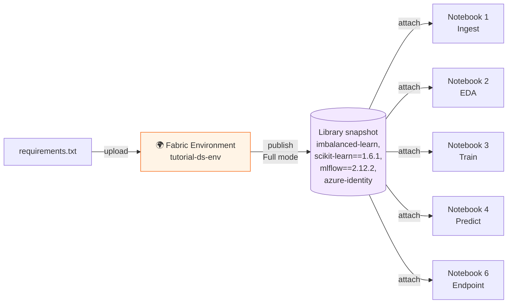

# Modul 7 — Create Fabric Environment (Optional)

> 🎯 **Tujuan**: Membuat **Fabric Environment** terpusat untuk seluruh tutorial series ini, sehingga setiap notebook (Modul 1–6) cukup di-*attach* ke environment yang sama tanpa perlu `%pip install` di tiap session.

> ⏱️ **Estimasi waktu**: 10–15 menit (publish Full mode butuh ~3–6 menit)

> 🧭 **Status**: **Opsional**. Tutorial ini bisa dijalankan tanpa Modul 7 — cukup pakai `%pip install` di tiap notebook seperti yang sudah ditunjukkan di Modul 3 & 4. Modul 7 berguna kalau kamu mau:
> - Reproducibility (versi library terkunci, sama untuk semua notebook)
> - Hemat waktu (tidak perlu re-install tiap session restart)
> - Workspace default untuk seluruh tim

---

## 📋 Daftar Isi

1. [Apa itu Fabric Environment?](#1-apa-itu-fabric-environment)
2. [Kapan butuh Environment?](#2-kapan-butuh-environment)
3. [Library yang dibutuhkan tutorial](#3-library-yang-dibutuhkan-tutorial)
4. [Step 1 — Buat Environment baru](#4-step-1--buat-environment-baru)
5. [Step 2 — Tambahkan library dari `requirements.txt`](#5-step-2--tambahkan-library-dari-requirementstxt)
6. [Step 3 — Pilih Spark runtime & publish](#6-step-3--pilih-spark-runtime--publish)
7. [Step 4 — Attach environment ke notebook](#7-step-4--attach-environment-ke-notebook)
8. [Step 5 — (Optional) Set sebagai workspace default](#8-step-5--optional-set-sebagai-workspace-default)
9. [Verifikasi & Troubleshooting](#9-verifikasi--troubleshooting)
10. [Cleanup](#10-cleanup)
11. [Referensi](#11-referensi)

---

## 1. Apa itu Fabric Environment?

**Fabric Environment** adalah workspace item yang menyimpan konfigurasi sesi Spark yang reusable — mencakup:

| Komponen | Fungsi |
|---|---|
| **Spark runtime** | Versi Spark + Python (mis. Runtime 1.3 = Spark 3.5 + Python 3.11) |
| **Spark compute** | Pool, executor size, dynamic allocation |
| **Libraries** | Public (PyPI/Conda), private repo, custom `.whl`/`.py` |
| **Resources** | File kecil (config, lookup CSV) yang bisa diakses dari notebook |

Notebook & Spark Job Definition yang **attached** ke environment akan otomatis mewarisi konfigurasi di atas.



---

## 2. Kapan butuh Environment?

| Skenario | Pakai Environment? |
|---|---|
| Belajar/eksplorasi cepat, satu notebook | ❌ Tidak — pakai `%pip install` cukup |
| Tutorial 5+ notebook dengan library sama | ✅ Ya — hemat waktu install berulang |
| Production / scheduled pipeline | ✅ Ya — reproducibility |
| Tim yang pakai workspace bersama | ✅ Ya — set sebagai *workspace default* |
| Library belum pre-installed di runtime (mis. `imblearn`) | ✅ Ya — atau `%pip install` per session |

> 📚 Sumber: [Why use an environment item — MS Learn](https://learn.microsoft.com/en-us/fabric/data-engineering/create-and-use-environment#why-use-an-environment-item)

---

## 3. Library yang dibutuhkan tutorial

Inventaris library berdasarkan Modul 1–6 (sudah dirangkum di file [`requirements.txt`](./requirements.txt)):

| Library | Versi | Dipakai di | Sudah built-in di runtime? |
|---|---|---|---|
| `pandas` | latest | Modul 2, 3, 6 | ✅ Built-in |
| `numpy` | latest | Modul 2, 3 | ✅ Built-in |
| `seaborn` | latest | Modul 2, 3 | ✅ Built-in |
| `matplotlib` | latest | Modul 2, 3 | ✅ Built-in |
| `scikit-learn` | **1.6.1** | Modul 3, 4, 6 | ⚠️ Built-in tapi versi beda — perlu pin |
| `mlflow` | **2.12.2** | Modul 3, 4, 6 | ⚠️ Built-in tapi versi beda — perlu pin |
| `lightgbm` | latest | Modul 3, 6 | ✅ Built-in |
| `imbalanced-learn` (`imblearn`) | 0.12.3 | Modul 3 (SMOTE) | ❌ **Tidak built-in** |
| `synapseml` | latest | Modul 4 (PREDICT) | ✅ Built-in |
| `pyspark` | latest | Modul 4 | ✅ Built-in |
| `requests` | latest | Modul 1, 6 | ✅ Built-in |
| `azure-identity` | ≥1.17.0 | Modul 6 (REST API auth) | ⚠️ Tergantung runtime — aman pin |

> 🔍 Daftar lengkap library built-in tiap runtime: [Apache Spark runtimes in Fabric](https://learn.microsoft.com/en-us/fabric/data-engineering/runtime)

Hasilnya `requirements.txt` minimalis — hanya yang **tidak built-in** atau **butuh pin versi**:

```text
imbalanced-learn==0.12.3
scikit-learn==1.6.1
mlflow==2.12.2
azure-identity>=1.17.0
```

> 📦 **Dua file disediakan** di repo ini — pilih sesuai kebutuhan:
>
> | File | Format | Kegunaan |
> |---|---|---|
> | [`requirements.txt`](./requirements.txt) | pip plain | Dokumentasi, install lokal (`pip install -r requirements.txt`), baca cepat |
> | [`environment.yml`](./environment.yml) | YML pip-deps | **Upload langsung** ke Fabric Environment (Opsi B di bawah) |

---

## 4. Step 1 — Buat Environment baru

1. Buka [Fabric portal](https://app.fabric.microsoft.com/) → masuk ke **workspace** kamu (yang sama dengan tutorial ini).
2. Klik **+ New item** → ketik `environment` di search bar → pilih tile **Environment**.

   

3. Beri nama: **`tutorial-ds-env`** → klik **Create**.

   > 💡 Konvensi nama: `<project>-<purpose>-env` agar mudah dikenali di workspace.

---

## 5. Step 2 — Tambahkan library dari `requirements.txt`

Fabric Environment mendukung 2 cara import library publik. Pilih **salah satu**.

### Opsi A — Tambah satu per satu via UI (recommended untuk belajar)

1. Di environment yang baru dibuat, klik tab **External repositories** di navigation kiri.
2. Klik **+ Add library** → **Add library from public repository**.
3. Pilih source: **PyPI**.
4. Untuk tiap baris di [`requirements.txt`](./requirements.txt), input nama lalu pilih versi:

   | Library name | Version |
   |---|---|
   | `imbalanced-learn` | `0.12.3` |
   | `scikit-learn` | `1.6.1` |
   | `mlflow` | `2.12.2` |
   | `azure-identity` | `1.17.0` (atau lebih baru) |

5. Untuk setiap library → pilih **Publish mode**: **Full** (snapshot stabil + reproducible).

   

### Opsi B — Upload `environment.yml` (lebih cepat untuk banyak library)

Fabric Environment menerima file YML dengan format `pip dependencies`. File [`environment.yml`](./environment.yml) di repo ini sudah siap pakai:

```yaml
dependencies:
  - pip:
    - imbalanced-learn==0.12.3
    - scikit-learn==1.6.1
    - mlflow==2.12.2
    - azure-identity>=1.17.0
```

Langkah upload:

1. Di environment → tab **External repositories** → klik **YML editor view** (toggle di kanan atas).
2. **Copy-paste** isi `environment.yml` ke editor, atau klik tombol **Upload** kalau tersedia di UI.
3. Klik **Save**.

> ⚠️ **Catatan**: Fabric **belum** menerima file `requirements.txt` mentah — yang didukung adalah format YML di atas. Itulah sebabnya repo ini menyediakan **dua file**: `requirements.txt` untuk dokumentasi/install lokal, `environment.yml` untuk upload ke Fabric.
>
> Lihat juga skenario [Azure Artifact Feed YML](https://learn.microsoft.com/en-us/fabric/data-engineering/environment-manage-library#prepare-and-upload-a-yml-file) untuk private feed (cukup ganti URL `--index-url` dengan connection ID).

> 📚 Sumber: [Add library from public Python repository — MS Learn](https://learn.microsoft.com/en-us/fabric/data-engineering/environment-manage-library#add-a-library-from-a-public-python-repository)

---

## 6. Step 3 — Pilih Spark runtime & publish

### Pilih runtime

1. Klik tab **Spark compute** (atau **Home** → kotak runtime).
2. Pilih runtime yang **support semua library di atas**. Rekomendasi:

   | Runtime | Spark | Python | Delta | Status | Untuk tutorial ini |
   |---|---|---|---|---|---|
   | **Runtime 1.3** | 3.5.5 | 3.11 | 3.2 | GA (default) | ✅ Recommended |
   | Runtime 2.0 | 4.0.0 | 3.12 | 4.0 | Public Preview | ⚠️ OK kalau mau preview Spark 4 |
   | Runtime 1.2 | 3.4.1 | 3.10 | 2.4 | EOSA | ⚠️ Hindari (end of support) |

   > 📚 Detail runtime: [Runtime 1.3 (GA)](https://learn.microsoft.com/en-us/fabric/data-engineering/runtime-1-3) · [Runtime 2.0 (Preview)](https://learn.microsoft.com/en-us/fabric/data-engineering/runtime-2-0)

3. Setting compute lain (executor size, dynamic allocation) bisa dibiarkan **default** untuk tutorial.

### Publish

1. Di tab **Home**, klik **Publish** → **Publish all**.
2. Tunggu ~3–6 menit (Full mode resolve dependency + buat snapshot).
3. Status berubah dari `Publishing` → ✅ `Published`.

   

> ⚠️ **Penting**: Environment **harus di-publish** setiap kali ada perubahan di Libraries atau Spark compute, baru efektif.

> 📚 Sumber: [Save and publish changes — MS Learn](https://learn.microsoft.com/en-us/fabric/data-engineering/create-and-use-environment#save-and-publish-changes)

---

## 7. Step 4 — Attach environment ke notebook

Untuk **setiap notebook** tutorial (Modul 1–6):

1. Buka notebook di Fabric.
2. Di ribbon atas → klik dropdown **Environment** (default: *Workspace default*).
3. Pilih **`tutorial-ds-env`** → klik **Confirm**.

   

4. **Restart kernel** notebook agar environment baru efektif.

> 💡 Setelah environment ter-attach, kamu bisa **menghapus atau meng-comment** baris `%pip install` di Modul 3 & 4 — library sudah tersedia otomatis.

---

## 8. Step 5 — (Optional) Set sebagai workspace default

Kalau seluruh workspace mau pakai environment yang sama:

1. **Workspace settings** → **Data Engineering/Science** → **Spark settings** → tab **Environment**.
2. Toggle **Set default environment** → **On**.
3. Pilih **`tutorial-ds-env`** → **Save**.

Setelah ini, notebook baru di workspace otomatis pakai `tutorial-ds-env` tanpa perlu attach manual.

> ⚠️ Hanya **workspace admin** yang bisa update default environment setelah di-set.

> 📚 Sumber: [Attach environment as workspace default — MS Learn](https://learn.microsoft.com/en-us/fabric/data-engineering/create-and-use-environment#attach-an-environment-as-a-workspace-default)

---

## 9. Verifikasi & Troubleshooting

### ✅ Verifikasi: cek versi library terpasang

Buat cell baru di notebook (yang sudah attached ke `tutorial-ds-env`):

```python
import importlib.metadata as md

libs = ["imbalanced-learn", "scikit-learn", "mlflow", "azure-identity"]
for lib in libs:
    try:
        ver = md.version(lib)
        print(f"✅ {lib:<20} {ver}")
    except md.PackageNotFoundError:
        print(f"❌ {lib:<20} NOT INSTALLED")
```

Output yang benar:

```
✅ imbalanced-learn     0.12.3
✅ scikit-learn         1.6.1
✅ mlflow               2.12.2
✅ azure-identity       1.17.0
```

### Troubleshooting

| Masalah | Penyebab | Solusi |
|---|---|---|
| Publish gagal: *"package conflict"* | Versi library tidak kompatibel dengan runtime | Coba runtime lain (1.3 → 1.2), atau longgarkan pin (mis. `mlflow>=2.12,<3`) |
| Notebook masih bilang `ModuleNotFoundError: imblearn` | Notebook belum attached / belum restart kernel | Re-attach environment + **Stop session** → run ulang |
| Publish kelamaan (>10 menit) | Full mode + dependency tree besar | Tunggu sampai selesai, atau switch ke Quick mode untuk iterasi cepat |
| Versi library beda dari yang di-pin | Quick mode override Full mode untuk session itu | Cek mode tiap library, atau hapus duplikasi |
| *"Workspace outbound access protection blocks PyPI"* | Workspace pakai Private Link / Managed VNet | Pakai [Azure Artifact Feed](https://learn.microsoft.com/en-us/fabric/data-engineering/environment-manage-library#add-libraries-from-an-azure-artifact-feed) atau upload custom `.whl` |

> 💡 Log instalasi library **tidak muncul** di notebook. Pakai **Monitoring (Level 2)** di environment untuk troubleshoot.

---

## 10. Cleanup

Kalau tutorial sudah selesai dan environment tidak dipakai lagi:

1. Pastikan **tidak ada notebook** yang masih attached (atau attach ke *Workspace default*).
2. Kalau di-set sebagai *workspace default*, **toggle off** dulu di workspace settings.
3. Buka environment → **⋯** → **Delete**.

Atau via REST API:

```http
DELETE https://api.fabric.microsoft.com/v1/workspaces/{workspaceId}/environments/{environmentId}
```

Permission: `Environment.ReadWrite.All` atau `Item.ReadWrite.All`.

> 📚 Sumber: [Delete environment — MS Learn](https://learn.microsoft.com/en-us/fabric/data-engineering/create-and-use-environment#delete-an-environment)

---

## 11. Referensi

- 📘 [Create, configure, and use an environment in Fabric](https://learn.microsoft.com/en-us/fabric/data-engineering/create-and-use-environment) — overview lengkap
- 📘 [Manage libraries in Fabric environments](https://learn.microsoft.com/en-us/fabric/data-engineering/environment-manage-library) — public/private/custom library
- 📘 [Manage Apache Spark libraries in Fabric](https://learn.microsoft.com/en-us/fabric/data-engineering/library-management) — best practices
- 📘 [Apache Spark runtimes in Fabric](https://learn.microsoft.com/en-us/fabric/data-engineering/runtime) — daftar built-in library
- 📘 [Select publish mode for libraries](https://learn.microsoft.com/en-us/fabric/data-engineering/environment-manage-library#select-publish-mode-for-libraries) — Full vs Quick mode
- 📘 [Manage libraries with limited network access](https://learn.microsoft.com/en-us/fabric/data-engineering/environment-manage-library-with-outbound-access-protection) — kalau pakai Private Link

---

⬅️ Sebelumnya: [Modul 6 — ML Model Endpoints](./06-model-endpoints.md) | 🏠 [Kembali ke README](./README.md)
