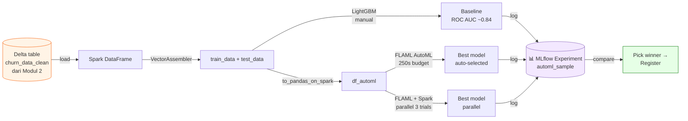
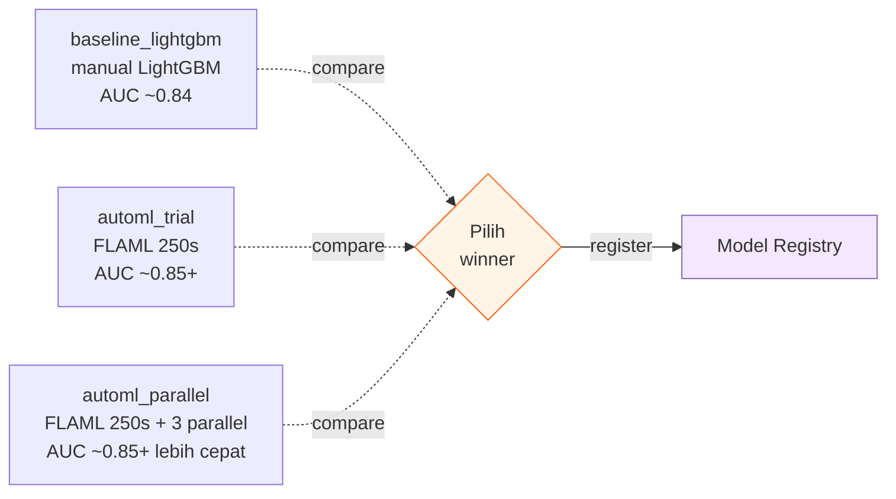

# Modul 8 — AutoML dengan FLAML (Automated Machine Learning)

> 🎯 **Tujuan**: Membandingkan **model yang dipilih manual** (Modul 3) dengan **model otomatis** yang dipilih oleh **FLAML AutoML** — supaya kamu paham kapan butuh AutoML dan kapan tidak.

> ⏱️ **Estimasi waktu**: 30–45 menit (termasuk AutoML trial 250 detik × 2)

> 📚 **Referensi resmi**: [Create models with Automated ML — MS Learn](https://learn.microsoft.com/en-us/fabric/data-science/how-to-use-automated-machine-learning-fabric)

> 🧩 **Prasyarat**: Modul 1 & 2 sudah selesai (sudah ada Delta table `churn_data_clean` di lakehouse). Kalau belum, balik dulu ke [Modul 2](./02-explore-cleanse-data.md).

---

## 📋 Daftar Isi

1. [Apa itu AutoML?](#1-apa-itu-automl)
2. [Kenapa FLAML di Fabric?](#2-kenapa-flaml-di-fabric)
3. [Arsitektur tutorial ini](#3-arsitektur-tutorial-ini)
4. [Step 1 — Setup notebook](#4-step-1--setup-notebook)
5. [Step 2 — Load data dari Lakehouse](#5-step-2--load-data-dari-lakehouse)
6. [Step 3 — Train baseline model (LightGBM manual)](#6-step-3--train-baseline-model-lightgbm-manual)
7. [Step 4 — AutoML trial dengan FLAML](#7-step-4--automl-trial-dengan-flaml)
8. [Step 5 — Parallel AutoML pakai Spark](#8-step-5--parallel-automl-pakai-spark)
9. [Step 6 — Bandingkan hasil di MLflow UI](#9-step-6--bandingkan-hasil-di-mlflow-ui)
10. [Step 7 — Register & gunakan model terbaik](#10-step-7--register--gunakan-model-terbaik)
11. [Best Practices & Troubleshooting](#11-best-practices--troubleshooting)
12. [Cleanup](#12-cleanup)
13. [Referensi](#13-referensi)

---

## 1. Apa itu AutoML?

**Automated Machine Learning (AutoML)** = teknik untuk **otomatisasi** proses ML yang biasanya butuh banyak tuning manual:

| Manual (Modul 3) | AutoML (Modul 8) |
|---|---|
| Kamu pilih algoritma (RandomForest, LightGBM, ...) | AutoML coba banyak algoritma sekaligus |
| Kamu tebak hyperparameter (`n_estimators=50`) | AutoML cari hyperparameter terbaik |
| Kamu evaluate satu per satu | AutoML evaluate puluhan/ratusan kombinasi |
| Cocok kalau kamu paham domain | Cocok untuk baseline cepat / bandingkan |

> 🧠 **Analogi**: Manual = kamu masak sendiri (tahu persis bumbu mana yang cocok). AutoML = kamu kasih bahan ke chef robot, dia coba 50 resep sekaligus dan pilih yang paling enak menurut kriteria kamu.

---

## 2. Kenapa FLAML di Fabric?

**[FLAML](https://github.com/microsoft/FLAML)** (Fast Library for Automated Machine Learning) adalah library AutoML open-source dari Microsoft Research — **sudah pre-installed** di Fabric Spark Runtime 1.2 ke atas.

| Kelebihan FLAML | Detail |
|---|---|
| ⚡ Cepat | Algoritma *cost-effective hyperparameter optimization* (CFO + BlendSearch) |
| 🐍 Python native | Cukup `from flaml import AutoML` |
| 🔄 Spark integration | Mendukung *Pandas-on-Spark* + paralel di Spark cluster |
| 📊 MLflow ready | Auto-log ke experiment yang sama dengan Modul 3 |
| 🆓 Built-in di Fabric | Tidak perlu `pip install` (Runtime 1.2+) |

---

## 3. Arsitektur tutorial ini



---

## 4. Step 1 — Setup notebook

1. Buka workspace Fabric → **+ New** → **Notebook**.
2. Beri nama: `08-automl-churn.ipynb`.
3. Di sidebar kiri → **Add lakehouse** → pilih lakehouse yang sama dari Modul 1 (sudah berisi table `churn_data_clean`).
4. *(Opsional)* Attach environment `tutorial-ds-env` dari [Modul 7](./07-create-environment.md).

> ⚠️ **Pastikan Runtime 1.2 atau 1.3** (Workspace settings → Spark settings). FLAML built-in mulai Runtime 1.2.

---

## 5. Step 2 — Load data dari Lakehouse

Karena kita sudah punya `churn_data_clean` (hasil Modul 2), tinggal load:

```python
# Load cleaned dataset dari Modul 2
df_final = spark.read.format("delta").load("Tables/churn_data_clean")

print(f"Total rows: {df_final.count()}")
df_final.printSchema()
```

> 💡 Kalau table belum ada → balik ke [Modul 2](./02-explore-cleanse-data.md) dan jalankan sampai akhir.

### Buat features + train/test split

```python
from pyspark.ml.feature import VectorAssembler

# Train-Test split 80/20 (seed=41 mengikuti dokumentasi MS Learn)
train_raw, test_raw = df_final.randomSplit([0.8, 0.2], seed=41)

# Semua kolom kecuali target "Exited" jadi feature
feature_cols = [c for c in df_final.columns if c != "Exited"]

# Gabungkan jadi vector "features" (format yang Spark ML butuhkan)
featurizer = VectorAssembler(inputCols=feature_cols, outputCol="features")

train_data = featurizer.transform(train_raw)["Exited", "features"]
test_data  = featurizer.transform(test_raw)["Exited", "features"]

print(f"train_data: {train_data.count()} rows")
print(f"test_data:  {test_data.count()} rows")
```

---

## 6. Step 3 — Train baseline model (LightGBM manual)

Ini **baseline** — model yang kita pilih sendiri tanpa AutoML, supaya nanti bisa dibandingkan.

### Setup MLflow

```python
import mlflow
import logging

# Suppress log SynapseML yang verbose
logging.getLogger('synapse.ml').setLevel(logging.ERROR)

# Set experiment + enable autolog (params, metrics, model otomatis ter-log)
mlflow.set_experiment("automl_sample")
mlflow.autolog(exclusive=False)
```

### Train + evaluate

```python
from synapse.ml.lightgbm import LightGBMClassifier
from sklearn.metrics import roc_auc_score

with mlflow.start_run(run_name="baseline_lightgbm") as run:
    # LightGBM dari SynapseML (terdistribusi di Spark)
    model = LightGBMClassifier(
        objective="binary",
        featuresCol="features",
        labelCol="Exited",
        dataTransferMode="bulk",
    )

    model = model.fit(train_data)

    # Predict di test set
    predictions = model.transform(test_data)

    # Ekstrak probabilitas kelas positif (index [1])
    y_pred = predictions.select("probability").rdd.map(lambda x: x[0][1]).collect()
    y_true = test_data.select("Exited").rdd.map(lambda x: x[0]).collect()

    roc_auc = roc_auc_score(y_true, y_pred)
    mlflow.log_metric("ROC_AUC", roc_auc)

    print(f"✅ Baseline ROC AUC: {roc_auc:.4f}")
```

> 📊 Hasil dokumentasi MS Learn: **ROC AUC ≈ 0.84**. Hasil kamu mungkin sedikit beda karena randomness.

---

## 7. Step 4 — AutoML trial dengan FLAML

Sekarang kita biarkan FLAML cari model + hyperparameter terbaik **secara otomatis**.

### Import & inisialisasi

```python
from flaml import AutoML
from flaml.automl.spark.utils import to_pandas_on_spark

automl = AutoML()
```

### Konfigurasi AutoML trial

```python
settings = {
    "time_budget": 250,                    # Total waktu eksplorasi (detik)
    "metric": "roc_auc",                   # Metric yang dioptimasi
    "task": "classification",              # Jenis task
    "log_file_name": "flaml_experiment.log",
    "seed": 41,                            # Reproducibility
    "force_cancel": True,                  # Stop kalau lewat time_budget
    "mlflow_exp_name": "automl_sample",   # Same experiment dengan baseline
}
```

| Setting | Penjelasan untuk pemula |
|---|---|
| `time_budget` | Berapa detik FLAML boleh "main" cari model. Makin lama, makin bagus (sampai titik tertentu). 250s = ~4 menit cocok untuk demo. |
| `metric` | Apa yang mau dimaksimalkan? `roc_auc` cocok untuk binary classification yang imbalance. Pilihan lain: `accuracy`, `f1`, `log_loss`. |
| `task` | `classification` / `regression` / `ts_forecast` / `rank` / `seq-classification` / `multichoice-classification` |
| `force_cancel` | `True` = kalau habis waktu, langsung stop. Berguna di Fabric agar tidak boros CU. |
| `seed` | Angka acak — sama → hasil sama. |

### Convert Spark → Pandas-on-Spark

FLAML butuh format **Pandas-on-Spark** supaya bisa proses data Spark tanpa harus collect ke driver:

```python
df_automl = to_pandas_on_spark(train_data)
print(f"Type: {type(df_automl).__name__}")  # → DataFrame (pyspark.pandas)
```

### Jalankan AutoML

```python
with mlflow.start_run(nested=True, run_name="automl_trial") as automl_run:
    automl.fit(
        dataframe=df_automl,
        label="Exited",
        isUnbalance=True,    # Penting: dataset churn imbalanced
        **settings,
    )
```

> ⏳ **Tunggu ~4 menit**. FLAML akan coba LightGBM, XGBoost, RandomForest, ExtraTrees, dll. dengan kombinasi hyperparameter berbeda. Progress tampil di output cell.

### Lihat hasil terbaik

```python
print("=== AutoML Results ===")
print(f"Best estimator     : {automl.best_estimator}")
print(f"Best hyperparams   : {automl.best_config}")
print(f"Best ROC AUC (val) : {1 - automl.best_loss:.4g}")
print(f"Training duration  : {automl.best_config_train_time:.4g}s")
```

> 🔑 **Note**: `automl.best_loss` adalah nilai **loss** (1 − AUC kalau metric=`roc_auc`). Makanya `1 - automl.best_loss` = ROC AUC sesungguhnya.

### Evaluate di test set

```python
import pandas as pd

# Convert test_data ke pandas untuk predict via FLAML
test_pdf = test_data.toPandas()
X_test = pd.DataFrame(test_pdf["features"].tolist(), columns=feature_cols)
y_test = test_pdf["Exited"]

y_pred_proba = automl.predict_proba(X_test)[:, 1]
automl_auc = roc_auc_score(y_test, y_pred_proba)

print(f"✅ AutoML test ROC AUC: {automl_auc:.4f}")
```

---

## 8. Step 5 — Parallel AutoML pakai Spark

Kalau dataset cukup kecil sehingga muat di satu node, kita bisa **paralelkan** beberapa trial AutoML sekaligus di Spark cluster — proses lebih cepat.

### Convert ke Pandas (bukan Pandas-on-Spark)

```python
pandas_df = train_raw.toPandas()
print(f"pandas_df shape: {pandas_df.shape}")
```

> ⚠️ Pakai `train_raw` (sebelum VectorAssembler) karena FLAML butuh format tabular biasa, bukan vector.

### Konfigurasi paralel

```python
settings_parallel = {
    "time_budget": 250,
    "metric": "roc_auc",
    "task": "classification",
    "seed": 41,
    "use_spark": True,           # ⬅️ Aktifkan Spark parallelism
    "n_concurrent_trials": 3,    # 3 trial jalan bareng
    "force_cancel": True,
    "mlflow_exp_name": "automl_sample",
}
```

| Setting baru | Penjelasan |
|---|---|
| `use_spark=True` | FLAML akan distribusikan trial ke Spark executor |
| `n_concurrent_trials=3` | 3 model di-train paralel. Sesuaikan dengan jumlah executor di workspace. |

### Jalankan paralel

```python
with mlflow.start_run(nested=True, run_name="automl_parallel") as parallel_run:
    automl.fit(
        dataframe=pandas_df,
        label="Exited",
        **settings_parallel,
    )

print("=== Parallel AutoML Results ===")
print(f"Best estimator    : {automl.best_estimator}")
print(f"Best hyperparams  : {automl.best_config}")
print(f"Best ROC AUC (val): {1 - automl.best_loss:.4g}")
print(f"Training duration : {automl.best_config_train_time:.4g}s")
```

> 📚 Detail: [FLAML parallel Spark jobs](https://microsoft.github.io/FLAML/docs/Examples/Integrate%20-%20Spark#parallel-spark-jobs)

---

## 9. Step 6 — Bandingkan hasil di MLflow UI

Karena semua run kita log ke experiment **`automl_sample`**, tinggal bandingkan visual:

1. Workspace → klik experiment **`automl_sample`**.
2. Pilih kolom **ROC_AUC** (atau metric lain) untuk sorting.
3. Centang 3 run: `baseline_lightgbm`, `automl_trial`, `automl_parallel`.
4. Klik **Compare** → lihat side-by-side params, metrics, charts.



> 💡 Biasanya AutoML **sedikit lebih bagus** dari baseline manual, tapi bukan magic — kalau dataset memang sulit, AutoML pun terbatas.

---

## 10. Step 7 — Register & gunakan model terbaik

Kalau model AutoML lebih bagus, register supaya bisa dipakai di Modul 4 (batch scoring) atau Modul 6 (endpoint).

```python
import mlflow
from mlflow.models.signature import infer_signature

# Train ulang model terbaik di seluruh training data
best_model = automl.model.estimator   # underlying sklearn-compatible model

# Predict & wrap output sebagai Series (penting untuk Modul 6 endpoint!)
preds = pd.Series(best_model.predict(X_test), name="prediction")
signature = infer_signature(X_test, preds)

# Log + register sebagai model baru di Fabric
with mlflow.start_run(run_name="automl_best_registered"):
    mlflow.sklearn.log_model(
        sk_model=best_model,
        artifact_path="model",
        signature=signature,
        input_example=X_test.head(3),
        registered_model_name="churn_automl_model",
    )

print("✅ Model registered as 'churn_automl_model'")
```

> 🔗 **Lanjut ke**: [Modul 4 — Batch Scoring](./04-batch-scoring.md) untuk inference batch, atau [Modul 6 — ML Model Endpoints](./06-model-endpoints.md) untuk real-time REST API.

---

## 11. Best Practices & Troubleshooting

### ✅ Best Practices

| Tip | Kenapa |
|---|---|
| Mulai dengan `time_budget` kecil (60–120s), lalu naikkan | Cek dulu pipeline benar sebelum buang waktu lama |
| Selalu set `seed` | Reproducibility |
| Pakai `mlflow_exp_name` yang sama dengan baseline | Mudah bandingkan di MLflow UI |
| `isUnbalance=True` untuk dataset imbalance | Tanpa ini, FLAML cenderung bias ke kelas mayoritas |
| `force_cancel=True` di Fabric | Hindari boros CU kalau lewat budget |
| Untuk dataset >10GB: pakai Pandas-on-Spark (Step 4), bukan parallel (Step 5) | Step 5 collect data ke 1 node — OOM untuk data besar |

### 🐛 Troubleshooting

| Masalah | Penyebab | Solusi |
|---|---|---|
| `ModuleNotFoundError: flaml` | Runtime <1.2 | Upgrade Workspace ke Runtime 1.2+ |
| AutoML stuck / hang | `force_cancel=False` + algoritma berat | Set `force_cancel=True` |
| ROC AUC anjlok di test set | Overfitting ke validation | Naikkan `time_budget`, atau set `early_stop=True` |
| `OutOfMemoryError` di Step 5 | `toPandas()` collect data terlalu besar | Pakai Step 4 (Pandas-on-Spark) saja, atau perbesar driver |
| MLflow run tidak muncul | Lupa `mlflow.set_experiment()` | Pastikan dipanggil sebelum `automl.fit()` |
| `n_concurrent_trials > executors` | Lebih banyak trial dari executor | Cek pool: Workspace settings → Spark pool → max nodes |

---

## 12. Cleanup

Kalau sudah selesai eksperimen:

```python
# Hapus model registered (kalau tidak dipakai)
from mlflow.tracking import MlflowClient

client = MlflowClient()
client.delete_registered_model(name="churn_automl_model")
```

Atau via UI: Workspace → ML model → ⋯ → **Delete**.

> 📝 **Note**: Experiment `automl_sample` dan run-nya tetap ada untuk audit trail. Hapus manual di UI kalau perlu.

---

## 13. Referensi

- 📘 [Create models with Automated ML — MS Learn](https://learn.microsoft.com/en-us/fabric/data-science/how-to-use-automated-machine-learning-fabric) — sumber utama tutorial ini
- 📘 [What is AutoML in Fabric?](https://learn.microsoft.com/en-us/fabric/data-science/automated-machine-learning-fabric) — konsep dasar
- 📘 [Tune AutoML with visualizations](https://learn.microsoft.com/en-us/fabric/data-science/tuning-automated-machine-learning-visualizations) — visualisasi advanced
- 📘 [FLAML documentation](https://microsoft.github.io/FLAML/) — referensi lengkap library
- 📘 [FLAML — Spark integration](https://microsoft.github.io/FLAML/docs/Examples/Integrate%20-%20Spark) — parallel & distributed
- 📘 [Apache Spark Runtimes in Fabric](https://learn.microsoft.com/en-us/fabric/data-engineering/runtime) — cek FLAML version

---

⬅️ Sebelumnya: [Modul 7 — Create Environment](./07-create-environment.md) | 🏠 [Kembali ke README](./README.md)
