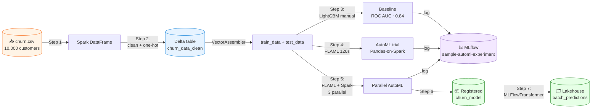

# Modul 8 — AutoML dengan FLAML (Automated Machine Learning)

> 🎯 **Tujuan**: Memahami **Automated ML (AutoML)** di Microsoft Fabric menggunakan **FLAML** — dari load data, training baseline, AutoML trial, parallelisasi dengan Spark, sampai register model & batch prediction.

> ⏱️ **Estimasi waktu**: 30–45 menit (termasuk dua AutoML trial × 120 detik)

> 📚 **Referensi resmi**: [Create models with Automated ML — MS Learn](https://learn.microsoft.com/en-us/fabric/data-science/how-to-use-automated-machine-learning-fabric)

> 📓 **Notebook**: [`notebooks/Automated ML (AutoML)-69.ipynb`](notebooks/Automated%20ML%20%28AutoML%29-69.ipynb) — notebook **self-contained** (tidak bergantung Modul 1/2). Bisa dijalankan langsung asalkan ada lakehouse.

---

## 📋 Daftar Isi

1. [Apa itu AutoML?](#1-apa-itu-automl)
2. [Kenapa FLAML di Fabric?](#2-kenapa-flaml-di-fabric)
3. [Arsitektur tutorial ini](#3-arsitektur-tutorial-ini)
4. [Step 1 — Load data](#4-step-1--load-data)
5. [Step 2 — Eksplorasi & preprocessing](#5-step-2--eksplorasi--preprocessing)
6. [Step 3 — Train baseline model (LightGBM)](#6-step-3--train-baseline-model-lightgbm)
7. [Step 4 — AutoML trial dengan FLAML](#7-step-4--automl-trial-dengan-flaml)
8. [Step 5 — Parallel AutoML pakai Spark](#8-step-5--parallel-automl-pakai-spark)
9. [Step 6 — Register model terbaik](#9-step-6--register-model-terbaik)
10. [Step 7 — Batch prediction dengan PREDICT](#10-step-7--batch-prediction-dengan-predict)
11. [Best Practices & Troubleshooting](#11-best-practices--troubleshooting)
12. [Cleanup](#12-cleanup)
13. [Referensi](#13-referensi)

---

## 1. Apa itu AutoML?

**Automated Machine Learning (AutoML)** = teknik untuk **otomatisasi** proses ML yang biasanya butuh banyak tuning manual:

| Manual (Modul 3) | AutoML (Modul 8) |
|---|---|
| Kamu pilih algoritma (RandomForest, LightGBM, ...) | AutoML coba banyak algoritma sekaligus |
| Kamu tebak hyperparameter (`n_estimators=50`) | AutoML cari hyperparameter terbaik |
| Kamu evaluate satu per satu | AutoML evaluate puluhan/ratusan kombinasi |
| Cocok kalau kamu paham domain | Cocok untuk baseline cepat / bandingkan |

> 🧠 **Analogi**: Manual = kamu masak sendiri (tahu persis bumbu mana yang cocok). AutoML = kamu kasih bahan ke chef robot, dia coba 50 resep sekaligus dan pilih yang paling enak menurut kriteria kamu.

> ⚠️ **Penting**: AutoML di Fabric (FLAML) **tidak melakukan data cleansing otomatis**. Kamu tetap harus:
> - Buang missing values & duplikat
> - One-hot encode kolom kategorikal
> - Drop kolom ID/tidak relevan
>
> Yang di-otomatisasi hanya: **pilih algoritma + tuning hyperparameter + cross-validation**.

---

## 2. Kenapa FLAML di Fabric?

**[FLAML](https://github.com/microsoft/FLAML)** (Fast Library for Automated Machine Learning) adalah library AutoML open-source dari Microsoft Research — **sudah pre-installed** di Fabric Spark Runtime 1.2 ke atas.

| Kelebihan FLAML | Detail |
|---|---|
| ⚡ Cepat | Algoritma *cost-effective hyperparameter optimization* (CFO + BlendSearch) |
| 🐍 Python native | Cukup `from flaml import AutoML` |
| 🔄 Spark integration | Mendukung *Pandas-on-Spark* + paralel di Spark cluster |
| 📊 MLflow ready | Auto-log ke experiment yang sama dengan baseline |
| 🆓 Built-in di Fabric | Tidak perlu `pip install` (Runtime 1.2+) |

> ⚠️ **Catatan Runtime**: AutoML di Fabric butuh **Runtime 1.2+ (Spark 3.4)** atau lebih baru.

---

## 3. Arsitektur tutorial ini



---

## Setup notebook

1. Buka workspace Fabric → **+ New** → **Import notebook** → unggah [`notebooks/Automated ML (AutoML)-69.ipynb`](notebooks/Automated%20ML%20%28AutoML%29-69.ipynb).
2. Di sidebar kiri notebook → **Add lakehouse** → pilih lakehouse yang ada (atau buat baru).
3. *(Opsional)* Attach environment `tutorial-ds-env` dari [Modul 7](./07-create-environment.md).
4. Pastikan **Runtime 1.2+** (Workspace settings → Spark settings).

> 💡 Notebook ini **self-contained**: Step 1 download CSV langsung dari URL, jadi tidak perlu menjalankan Modul 1/2 dulu. Tapi kalau kamu sudah punya `churn_data_clean` dari Modul 2, kamu bisa skip Step 1 & 2 dan langsung lompat ke Step 3.

---

## 4. Step 1 — Load data

### Dataset: Bank Customer Churn

10.000 baris × 14 kolom. Target: kolom **`Exited`** (1 = customer keluar dari bank, 0 = tetap). Dataset **imbalanced**: hanya ~20% (2.037) yang churn.

| Kolom penting | Tipe |
|---|---|
| `CreditScore`, `Age`, `Tenure`, `Balance`, `EstimatedSalary` | Numerik |
| `Geography` (France/Germany/Spain), `Gender` (Male/Female) | Kategorikal |
| `NumOfProducts`, `HasCrCard`, `IsActiveMember` | Numerik biner |
| `RowNumber`, `CustomerId`, `Surname` | ID — akan dibuang |
| **`Exited`** | **Target (0/1)** |

### Download data ke lakehouse

```python
import os
import requests

IS_CUSTOM_DATA = False  # if TRUE, dataset has to be uploaded manually

if not IS_CUSTOM_DATA:
    remote_url = "https://synapseaisolutionsa.z13.web.core.windows.net/data/bankcustomerchurn"
    file_list = ["churn.csv"]
    download_path = "/lakehouse/default/Files/churn/raw"

    if not os.path.exists("/lakehouse/default"):
        raise FileNotFoundError("Default lakehouse not found. Please add a lakehouse and restart the session.")

    os.makedirs(download_path, exist_ok=True)

    for fname in file_list:
        if not os.path.exists(f"{download_path}/{fname}"):
            r = requests.get(f"{remote_url}/{fname}", timeout=30)
            with open(f"{download_path}/{fname}", "wb") as f:
                f.write(r.content)

    print("Downloaded demo data files into lakehouse.")
```

### Read raw CSV → Spark DataFrame

```python
df = (
    spark.read.option("header", True)
    .option("inferSchema", True)
    .csv("Files/churn/raw/churn.csv")
    .cache()
)
```

> 💡 `.cache()` mempercepat operasi berikutnya karena Spark menyimpan dataframe di memory.

---

## 5. Step 2 — Eksplorasi & preprocessing

### Display + summary statistics

```python
display(df, summary=True)
```

> 📊 Fabric `display()` punya tab **Chart** & **Summary** built-in — jauh lebih kaya dari `df.show()` biasa.

### Cleaning function

```python
def clean_data(df):
    # Drop rows with missing data across all columns
    df = df.dropna(how="all")
    # Drop duplicate rows in columns: 'RowNumber', 'CustomerId'
    df = df.dropDuplicates(subset=["RowNumber", "CustomerId"])
    # Drop columns: 'RowNumber', 'CustomerId', 'Surname'
    df = df.drop("RowNumber", "CustomerId", "Surname")
    return df

df_copy = df.select("*")
df_clean = clean_data(df_copy)
```

| Operasi | Kenapa |
|---|---|
| `dropna(how="all")` | Buang baris yang **semua** kolomnya kosong |
| `dropDuplicates(subset=["RowNumber","CustomerId"])` | Hindari customer ganda |
| `drop("RowNumber","CustomerId","Surname")` | Kolom ID tidak punya predictive power, malah bikin model overfit |

### One-hot encoding kolom kategorikal

```python
from pyspark.sql import functions as F

df_clean = df_clean.select(
    "*",
    F.when(F.col("Geography") == "France", 1).otherwise(0).alias("Geography_France"),
    F.when(F.col("Geography") == "Germany", 1).otherwise(0).alias("Geography_Germany"),
    F.when(F.col("Geography") == "Spain", 1).otherwise(0).alias("Geography_Spain"),
    F.when(F.col("Gender") == "Female", 1).otherwise(0).alias("Gender_Female"),
    F.when(F.col("Gender") == "Male", 1).otherwise(0).alias("Gender_Male"),
)

df_clean = df_clean.drop("Geography", "Gender")
```

> 🔑 **Wajib**: AutoML/FLAML butuh semua kolom **numerik**. String seperti "France" harus di-encode dulu jadi 0/1.

### Save ke lakehouse sebagai Delta table

```python
df_clean.write.mode("overwrite").format("delta").save("Tables/churn_data_clean")
print("Spark dataframe saved to delta table: churn_data_clean")
```

> 💾 Hasilnya bisa di-query SQL, dipakai di Power BI Direct Lake, dan tahan banting (ACID).

---

## 6. Step 3 — Train baseline model (LightGBM)

Sebelum AutoML, kita train **baseline manual** dulu — supaya nanti bisa dibandingkan apakah AutoML benar-benar lebih baik.

### Load data + train/test split

```python
df_final = spark.read.format("delta").load("Tables/churn_data_clean")
```

```python
from pyspark.ml.feature import VectorAssembler

# Train-Test split 80/20 (seed=41)
train_raw, test_raw = df_final.randomSplit([0.8, 0.2], seed=41)

# Semua kolom kecuali "Exited" jadi feature
feature_cols = [col for col in df_final.columns if col != "Exited"]

# Gabung jadi vector "features"
featurizer = VectorAssembler(inputCols=feature_cols, outputCol="features")

train_data = featurizer.transform(train_raw)["Exited", "features"]
test_data  = featurizer.transform(test_raw)["Exited", "features"]
```

### Setup logging + MLflow

```python
import logging

# Suppress log SynapseML & MLflow yang verbose
logging.getLogger("synapse.ml").setLevel(logging.CRITICAL)
logging.getLogger("mlflow.utils").setLevel(logging.CRITICAL)
```

```python
import mlflow

# Auto-log params, metrics, model
mlflow.autolog(exclusive=False)

# Set experiment name (dipakai juga di Step 4)
mlflow.set_experiment("sample-automl-experiment")
```

### Train + evaluate baseline

```python
from synapse.ml.lightgbm import LightGBMClassifier
from sklearn.metrics import roc_auc_score

with mlflow.start_run(run_name="default") as run:
    model = LightGBMClassifier(
        objective="binary",
        featuresCol="features",
        labelCol="Exited",
        dataTransferMode="bulk",
    )

    model = model.fit(train_data)
    predictions = model.transform(test_data)

    # Probabilitas kelas positif (index [1])
    y_pred = predictions.select("probability").rdd.map(lambda x: x[0][1]).collect()
    y_true = test_data.select("Exited").rdd.map(lambda x: x[0]).collect()

    roc_auc = roc_auc_score(y_true, y_pred)
    mlflow.log_metric("roc_auc", roc_auc)

    print("ROC AUC Score:", roc_auc)
```

> 📊 Hasil ekspektasi: **ROC AUC ≈ 0.84**.

---

## 7. Step 4 — AutoML trial dengan FLAML

Sekarang biarkan FLAML cari model + hyperparameter terbaik **secara otomatis**.

### Inisialisasi & konfigurasi

```python
from flaml import AutoML
from flaml.automl.spark.utils import to_pandas_on_spark

automl_spark = AutoML()

settings = {
    "time_budget": 120,                            # Detik
    "max_iter": 3,                                 # Maksimum jumlah trial
    "metric": "roc_auc",                           # Metric yang dioptimasi
    "task": "classification",                      # Jenis task
    "log_file_name": "flaml_experiment.log",
    "seed": 41,                                    # Reproducibility
    "mlflow_exp_name": "sample-automl-experiment", # Sama dengan baseline
    "verbose": 1,
}
```

| Setting | Penjelasan |
|---|---|
| `time_budget` | Berapa detik FLAML boleh "main". 120s cocok untuk demo. |
| `max_iter` | Batas jumlah model yang dicoba. Set kecil (3) untuk demo cepat. |
| `metric` | `roc_auc` cocok untuk klasifikasi binary imbalance. |
| `task` | `classification` / `regression` / `ts_forecast` / dll. |
| `seed` | Sama → hasil sama (reproducible). |
| `mlflow_exp_name` | Pakai experiment yang sama → mudah bandingkan dengan baseline. |
| `verbose` | 0=silent, 1=normal, 2=detail, 3=debug |

### Convert Spark → Pandas-on-Spark

FLAML butuh format **Pandas-on-Spark** untuk proses Spark dataset:

```python
df_automl = to_pandas_on_spark(train_data)
```

### Jalankan AutoML

```python
with mlflow.start_run(nested=True, run_name="spark_automl"):
    automl_spark.fit(
        dataframe=df_automl,
        label="Exited",
        isUnbalance=True,           # Penting: dataset imbalanced
        dataTransferMode="bulk",    # Untuk LightGBM-on-Spark
        **settings,
    )
```

> ⏳ Tunggu ~2 menit. FLAML akan coba LightGBM, XGBoost, RandomForest, dll. Progress tampil di output.

### Lihat hasil terbaik

```python
if automl_spark.best_config is None:
    print("No best config found. Try running the AutoML process again with more time budget.")
else:
    print("Best hyperparameter config:", automl_spark.best_config)
    print("Best ROC AUC on validation data: {0:.4g}".format(1 - automl_spark.best_loss))
    print("Training duration of the best run: {0:.4g} s".format(automl_spark.best_config_train_time))
```

> 🔑 `automl_spark.best_loss` = nilai **loss** (1 − AUC). Maka `1 - best_loss` = ROC AUC sebenarnya.

---

## 8. Step 5 — Parallel AutoML pakai Spark

Kalau dataset cukup kecil sehingga muat di **satu node**, kita bisa **paralelkan** banyak trial AutoML sekaligus di Spark cluster — proses lebih cepat.

### Convert ke Pandas (bukan Pandas-on-Spark)

```python
pandas_df = train_raw.toPandas()
```

> ⚠️ Pakai `train_raw` (sebelum VectorAssembler) karena FLAML versi paralel butuh tabular biasa, bukan vector kolom.

### Konfigurasi paralel

```python
# Buat AutoML instance baru
automl = AutoML()

# Set experiment baru biar terpisah dari Step 4
mlflow.set_experiment("sample-automl-experiment-spark")

settings = {
    "time_budget": 120,
    "max_iter": 3,
    "metric": "roc_auc",
    "task": "classification",
    "seed": 41,
    "use_spark": True,                                  # ⬅️ Aktifkan Spark parallel
    "n_concurrent_trials": 3,                           # 3 trial bareng
    "force_cancel": True,                               # Stop kalau lewat budget
    "mlflow_exp_name": "sample-automl-experiment-spark",
    "verbose": 1,
}
```

| Setting baru | Penjelasan |
|---|---|
| `use_spark=True` | FLAML distribusikan trial ke Spark executor |
| `n_concurrent_trials=3` | 3 model paralel — sesuaikan dengan jumlah executor |
| `force_cancel=True` | Stop saat lewat `time_budget` → hemat CU |

### Jalankan paralel

```python
with mlflow.start_run(nested=True, run_name="parallel_trial"):
    automl.fit(dataframe=pandas_df, label="Exited", **settings)
```

### Visualisasi feature importance

```python
import flaml.visualization as fviz

fig = fviz.plot_feature_importance(automl)

if fig is None:
    print("No feature importance plot available. Try running the AutoML process again with more time budget.")
else:
    fig.show()
```

> 📊 Plot interaktif Plotly: lihat fitur mana yang paling berkontribusi (biasanya `Age`, `NumOfProducts`, `Balance` paling tinggi untuk dataset churn ini).

### Lihat hasil

```python
if automl.best_config is None:
    print("No best config found. Try running the AutoML process again with more time budget.")
else:
    print("Best hyperparmeter config:", automl.best_config)
    print("Best roc_auc on validation data: {0:.4g}".format(1 - automl.best_loss))
    print("Training duration of best run: {0:.4g} s".format(automl.best_config_train_time))
```

### Lihat di MLflow UI

1. Workspace → klik experiment **`sample-automl-experiment`** atau **`sample-automl-experiment-spark`**.
2. Sortir kolom **roc_auc** untuk lihat run terbaik.
3. Centang beberapa run → klik **Compare** untuk side-by-side.

---

## 9. Step 6 — Register model terbaik

Setelah AutoML selesai, register model terbaik ke Fabric Model Registry supaya bisa dipakai untuk batch scoring atau endpoint.

```python
model_name = "churn_model"  # Ganti sesuai keinginan

if automl.best_run_id is None:
    print("No best run ID found. Try running the AutoML process again with more time budget.")
    registered_model = None
else:
    model_path = f"runs:/{automl.best_run_id}/model"
    registered_model = mlflow.register_model(model_uri=model_path, name=model_name)
    print(f"Model '{registered_model.name}' version {registered_model.version} registered successfully.")
```

> 📦 Cara kerjanya: FLAML otomatis log model terbaik ke MLflow setiap run. `automl.best_run_id` adalah ID MLflow run untuk model terbaik. Kita ambil model dari `runs:/<id>/model` lalu register.

> 🔍 Lihat di UI: Workspace → **ML model** → `churn_model` → akan muncul versionnya.

---

## 10. Step 7 — Batch prediction dengan PREDICT

Microsoft Fabric punya fungsi **`PREDICT`** untuk batch scoring scalable (Spark-distributed). Kita pakai wrapper-nya: `MLFlowTransformer`.

### Cek data test

```python
display(test_raw)
```

### Jalankan batch prediction

```python
from synapse.ml.predict import MLFlowTransformer

if registered_model is None:
    print("No registered model found. Please ensure the AutoML process completed successfully.")
    batch_predictions = None
else:
    model = MLFlowTransformer(
        inputCols=feature_cols,
        outputCol="prediction",
        modelName=model_name,
        modelVersion=registered_model.version,
    )

    batch_predictions = model.transform(test_raw)
```

### Tampilkan hasil

```python
display(batch_predictions)
```

### Simpan ke lakehouse

```python
if batch_predictions is None:
    print("No predictions to save. Ensure the model was registered and predictions were generated successfully.")
else:
    batch_predictions.write.format("delta").mode("overwrite").save("Files/churn/predictions/batch_predictions")
```

> 🔗 **Lanjut ke**:
> - [Modul 4 — Batch Scoring](./04-batch-scoring.md) untuk pola batch scoring lain (PREDICT SQL).
> - [Modul 5 — Create Report](./05-create-report.md) untuk bikin Power BI report dari hasil prediksi.
> - [Modul 6 — ML Model Endpoints](./06-model-endpoints.md) untuk deploy ke real-time REST endpoint.

---

## 11. Best Practices & Troubleshooting

### ✅ Best Practices

| Tip | Kenapa |
|---|---|
| Mulai dengan `time_budget` kecil (60–120s) + `max_iter=3`, lalu naikkan | Cek pipeline benar dulu sebelum buang waktu lama |
| Selalu set `seed` | Reproducibility — hasil sama di setiap run |
| Pakai `mlflow_exp_name` yang sama dengan baseline | Mudah bandingkan di MLflow UI |
| `isUnbalance=True` untuk dataset imbalance | Tanpa ini, model bias ke kelas mayoritas |
| `force_cancel=True` di Fabric | Hindari boros CU kalau lewat budget |
| **Cleansing dulu sebelum AutoML** | FLAML tidak handle missing values & encoding otomatis |
| Untuk dataset >10GB: pakai Pandas-on-Spark (Step 4) | Step 5 collect ke 1 node — OOM untuk data besar |
| Cek feature importance plot | Insight bisnis: fitur mana yang penting |

### 🐛 Troubleshooting

| Masalah | Penyebab | Solusi |
|---|---|---|
| `ModuleNotFoundError: flaml` | Runtime <1.2 | Upgrade Workspace → Spark settings → Runtime 1.2+ |
| `Default lakehouse not found` | Lupa attach lakehouse | Sidebar kiri notebook → Add lakehouse |
| `automl.best_config is None` | Time budget terlalu kecil | Naikkan `time_budget` (mis. 300) atau `max_iter` (mis. 10) |
| `automl.best_run_id is None` di Step 6 | AutoML tidak sempat selesai 1 trial pun | Naikkan budget |
| AutoML stuck / hang | `force_cancel=False` + algoritma berat | Set `force_cancel=True` |
| ROC AUC anjlok di test set | Overfitting ke validation | Naikkan `time_budget`, atau set `early_stop=True` |
| `OutOfMemoryError` di Step 5 | `toPandas()` collect data terlalu besar | Pakai Step 4 (Pandas-on-Spark) saja, atau perbesar driver |
| MLflow run tidak muncul | Lupa `mlflow.set_experiment()` | Pastikan dipanggil sebelum `automl.fit()` |
| `n_concurrent_trials > executors` | Lebih banyak trial dari executor | Cek pool: Workspace settings → Spark pool → max nodes |
| `MLFlowTransformer` error | Versi model tidak ada | Cek `registered_model.version` benar di Step 6 |

---

## 12. Cleanup

Kalau sudah selesai eksperimen:

```python
# Hapus model registered (opsional)
from mlflow.tracking import MlflowClient

client = MlflowClient()
client.delete_registered_model(name="churn_model")
```

Atau via UI: Workspace → **ML model** → `churn_model` → ⋯ → **Delete**.

> 📝 Experiment `sample-automl-experiment` & `sample-automl-experiment-spark` tetap ada untuk audit trail. Hapus manual via UI kalau perlu.

---

## 13. Referensi

- 📘 [Create models with Automated ML — MS Learn](https://learn.microsoft.com/en-us/fabric/data-science/how-to-use-automated-machine-learning-fabric) — sumber utama tutorial ini
- 📘 [What is AutoML in Fabric?](https://learn.microsoft.com/en-us/fabric/data-science/automated-machine-learning-fabric) — konsep dasar & daftar model didukung
- 📘 [Tune AutoML with visualizations](https://learn.microsoft.com/en-us/fabric/data-science/tuning-automated-machine-learning-visualizations) — visualisasi advanced
- 📘 [Score models with PREDICT](https://learn.microsoft.com/en-us/fabric/data-science/model-scoring-predict) — batch inference
- 📘 [FLAML documentation](https://microsoft.github.io/FLAML/) — referensi lengkap
- 📘 [FLAML — Spark integration](https://microsoft.github.io/FLAML/docs/Examples/Integrate%20-%20Spark) — parallel & distributed
- 📘 [Apache Spark Runtimes in Fabric](https://learn.microsoft.com/en-us/fabric/data-engineering/runtime) — cek versi FLAML

---

⬅️ Sebelumnya: [Modul 7 — Create Environment](./07-create-environment.md) | 🏠 [Kembali ke README](./README.md)
