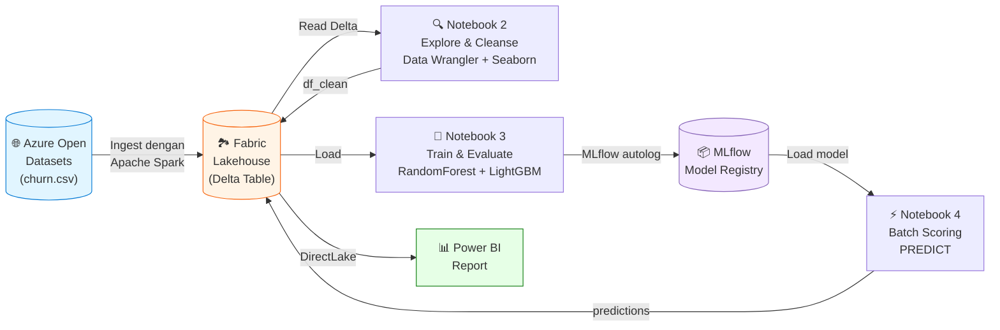
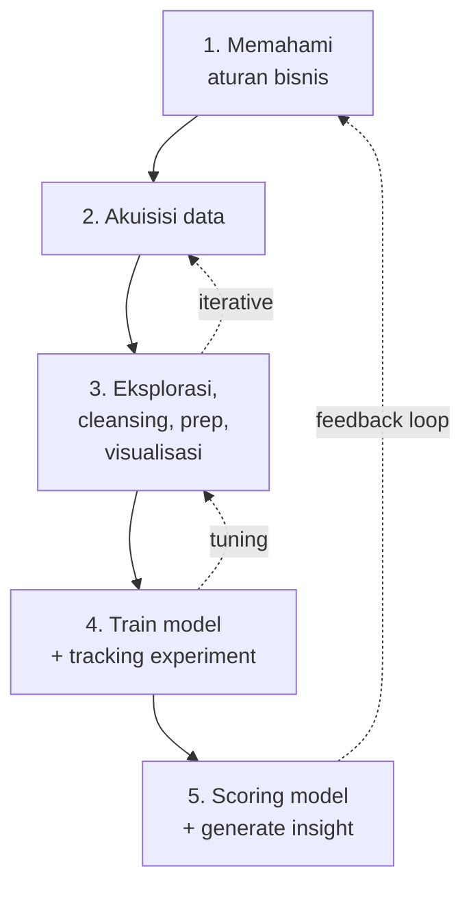

# Tutorial Series: Microsoft Fabric Data Science — End-to-End

Tutorial series ini menyajikan skenario **end-to-end Data Science** di Microsoft Fabric, mulai dari ingest data hingga visualisasi prediksi di Power BI. Materi disusun berdasarkan dokumentasi resmi Microsoft.

> Studi kasus: Anda berperan sebagai **Data Scientist** sebuah bank yang ingin memprediksi nasabah mana yang berpotensi *churn* (menutup rekening) dari dataset 10.000 nasabah.

*Gambar: Diagram arsitektur end-to-end data science scenario (sumber: Microsoft Learn).*

---

## 📚 Daftar Isi Tutorial

| # | Modul | Deskripsi |
|---|-------|-----------|
| 0 | [Prepare System](./00-prepare-system.md) | Persiapan workspace, lakehouse, dan notebook |
| 1 | [Ingest Data](./01-ingest-data.md) | Memasukkan data ke Fabric Lakehouse dengan Apache Spark |
| 2 | [Explore & Cleanse Data](./02-explore-cleanse-data.md) | EDA dan pembersihan data dengan Data Wrangler & Seaborn |
| 3 | [Train & Evaluate Models](./03-train-evaluate.md) | Train Random Forest & LightGBM + tracking dengan MLflow |
| 4 | [Batch Scoring](./04-batch-scoring.md) | Inference batch dengan PREDICT |
| 5 | [Create Power BI Report](./05-create-report.md) | Visualisasi hasil prediksi dengan Power BI |
| 6 | [ML Model Endpoints](./06-model-endpoints.md) | Real-time inference via REST API endpoint (Preview) |
| 7 | [Create Environment](./07-create-environment.md) *(opsional)* | Setup Fabric Environment terpusat + `requirements.txt` |
| 8 | [AutoML dengan FLAML](./08-automl.md) | Automated ML — bandingkan model manual vs auto-selected |

---

## 🏗️ Arsitektur End-to-End

## 🔄 Lifecycle Data Science Project

---

## 🧩 Komponen Utama Fabric Data Science

| Komponen | Fungsi |
|----------|--------|
| **Lakehouse** | Penyimpanan terpadu (Delta Lake) untuk file & tabel |
| **Notebook (Spark / Python)** | Tempat menulis kode ingest, EDA, training |
| **Data Wrangler** | UI low-code untuk eksplorasi & cleansing pandas DataFrame |
| **MLflow** | Tracking eksperimen, registry model |
| **PREDICT** | Fungsi scalable untuk batch inference |
| **Power BI (DirectLake)** | Visualisasi hasil langsung dari Lakehouse |

---

## ✅ Prasyarat Umum

- Akun [Microsoft Fabric](https://fabric.microsoft.com/) (atau [free trial](https://learn.microsoft.com/en-us/fabric/fundamentals/fabric-trial))
- Workspace dengan kapasitas Fabric aktif
- Pengetahuan dasar Python & Apache Spark

> Mulai dari **[Modul 0 — Prepare System](./00-prepare-system.md)**.

---

## ⚠️ Disclaimer

Materi tutorial ini disusun untuk **tujuan edukasi dan pembelajaran pribadi**, berdasarkan dokumentasi resmi Microsoft.

- Konten teks merupakan adaptasi/terjemahan bebas ke Bahasa Indonesia oleh penulis repo ini, **bukan** dokumen resmi dari Microsoft.
- Seluruh **gambar, diagram, dan screenshot** yang ditampilkan adalah hak cipta **© Microsoft Corporation** dan diambil langsung dari dokumentasi resmi Microsoft untuk kepentingan referensi pembelajaran.
- Nama produk seperti *Microsoft Fabric*, *Power BI*, *Azure*, dan *MLflow* adalah merek dagang dari pemiliknya masing-masing.
- Penulis **tidak berafiliasi resmi** dengan Microsoft. Untuk informasi paling akurat dan terbaru, selalu rujuk ke dokumentasi resmi Microsoft.
- Repo ini disediakan **"as is"** tanpa jaminan apa pun. Penulis tidak bertanggung jawab atas biaya, kerugian, atau konsekuensi yang timbul dari penggunaan materi di sini.

Jika Anda adalah pemilik hak cipta dan keberatan dengan penggunaan materi tertentu, silakan buka issue di repository ini.
